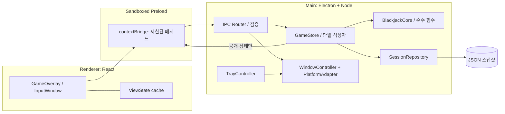
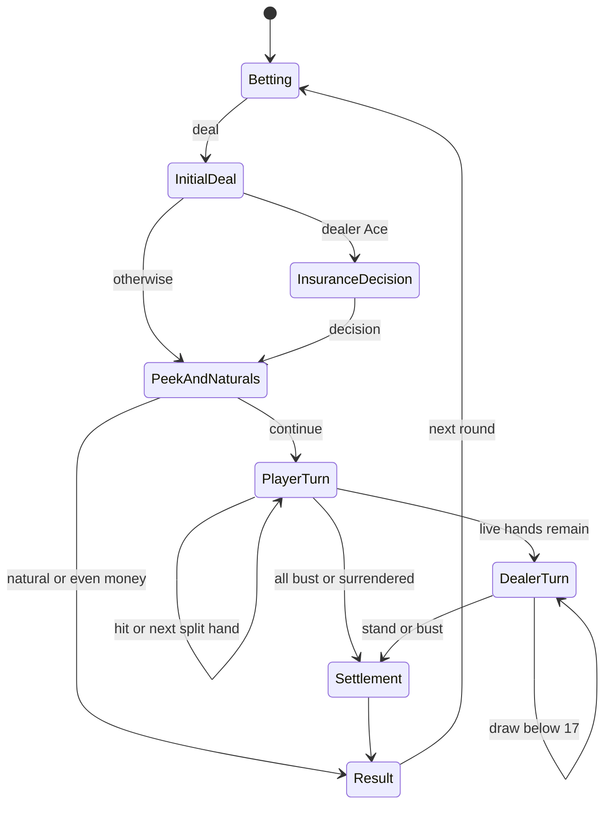

# molsino Blackjack 기술 설계 — Electron

버전: 2.1 · 작성일: 2026-09-15 · 갱신일: 2026-09-16 · 상태: P0 일부·P1 구현 완료

기능·카지노 규칙의 기준은 [제품 설계서](blackjack-design.md)다. 본 문서는 Electron 기반의 프로세스, IPC, 창·입력, 엔진, 저장, 빌드·검증 계약을 정의한다. 기존 macOS 네이티브 및 Windows 별도 포팅 설계를 대체한다.

## 1. 확정한 기술 결정

**macOS와 Windows에서 같은 화면·게임 엔진·저장 코드를 실행한다. macOS에서 먼저 개발·검증하되 Windows도 처음부터 빌드와 테스트 대상으로 둔다.**

| 계층 | 선택 | 역할 |
| --- | --- | --- |
| 데스크톱 런타임 | Electron | 창, 포커스, 트레이, 화면 정보, 앱 수명 |
| 언어 | TypeScript, strict 모드 | Main·Preload·Renderer·게임 코어 공통 |
| 화면 | React + CSS | 작은 흑백 UI, 상태별 카드·컨트롤 |
| 개발 / 패키징 | Electron Forge + Vite | 번들링, 개발 서버, OS별 패키지 생성 |
| 게임 엔진 | 순수 TypeScript 모듈 | 카지노 규칙, 상태 전이, 지급액 |
| 저장 | Main의 Node.js 파일 API + JSON | 원자적 스냅샷, 복원, 백업 |
| 계약 검증 | Zod | IPC·저장 데이터의 런타임 검증 |
| 테스트 | Vitest, Playwright Electron 실험 API | 엔진·저장·IPC·화면 검증, OS 수동 확인 병행 |

구현 시작 시 유지보수 중인 안정 Electron과 호환되는 Forge·Vite·React·테스트 버전을 선택해 package-lock.json으로 고정한다. 설계 문서의 최신 API가 그 버전에 있다고 가정하지 않는다. 개발 Node 버전은 선택한 툴체인의 요구에 맞춰 고정하며 Electron 내장 Node와 구분한다.

초기 검증 목표는 macOS 14 이상 arm64와 Windows 11 x64다. 선택한 Electron의 지원 범위와 실제 장비 검증을 모두 만족한 범위만 배포 지원으로 표기한다. macOS x64와 Windows arm64는 별도 검증 후 추가한다.

게임은 6덱, $100 시작, 기본 베팅 $1–$500(잔액 이내), 보험·이븐 머니·더블·스플릿·레이트 서렌더를 유지한다. 네트워크·LLM 호출 없이 실행한다. Electron은 여러 프로세스를 사용하지만 앱 인스턴스와 게임 상태의 소유자는 하나다.

## 2. 펫 레퍼런스와 적용 범위

### 2.1 공식 문서에서 확인한 펫 동작

ChatGPT 데스크톱의 펫은 macOS와 Windows에서 다른 앱 위에 떠 있고, 드래그 이동·크기 설정·숨기기·위치 복원을 지원한다. OS의 동작 줄이기 설정도 따른다. 이 사용자 경험을 기준으로 삼는다. [OpenAI 공식 Pets 문서](https://learn.chatgpt.com/docs/pets)

### 2.2 설치된 앱에서 읽기 전용으로 확인한 구현 단서

조사 대상은 `/Applications/ChatGPT.app/Contents/Resources/app.asar`이며 번들 식별자는 `com.openai.codex`였다. 패키지 목록과 관련 코드 구간만 읽었고 설치 파일을 변경하지 않았다.

| 관찰 위치 / 심볼 | 확인한 내용 | 이 게임에 적용할 원리 |
| --- | --- | --- |
| `webview/assets/pet-content-*.js`, `pet-model-*.js` | 펫 화면·모델용 번들 존재 | 창 계층과 화면 상태를 분리 |
| `.vite/build/main-DaMR-wdT.js`, `avatar-overlay` | Electron BrowserWindow 기반 오버레이 제어 코드 | 일반 메인 창과 다른 수명·입력 정책 |
| `showWindow`, `showInactive` | 비활성 상태로 오버레이 표시 | 복원 시 업무 창의 포커스 유지 |
| `setAlwaysOnTop(..., floating)`, `setVisibleOnAllWorkspaces` | 창 레벨과 작업 공간 처리 | 상단 표시와 Spaces 정책을 별도 관리 |
| `setPointerInteraction`, `setKeyboardInteraction` | 마우스와 키보드 상호작용을 각각 관리 | 클릭 수신과 키보드 포커스를 분리 |
| `setIgnoreMouseEvents`와 forwarding 분기 | 클릭 통과 전환 및 이동 이벤트 처리 | 클릭 통과 상태에서도 복구 경로 필요 |
| `isInputShapeSupported`, `setInputShape` | 입력 영역 지원 여부에 따른 분기 | 선택적 클릭 통과는 OS 기능 확인 후 적용 |
| `displayId`, `anchor`, 드래그·화면 변경 처리 | 화면과 기준점 중심의 위치 관리 | 다중 모니터와 위치 복원 모델 |

이 표는 **설치된 특정 빌드의 정적 관찰**이다. 공개 API 계약이나 모든 버전의 구현을 의미하지 않는다. `setInputShape`가 일반 배포 Electron 에서 동일하게 사용 가능하다고 가정하지 않는다. 펫 전체 소스나 내부 로직을 복제하지 않고 공개 OS API로 같은 동작을 구현한다.

### 2.3 이번 구현에 적용하는 결정

펫에서 확인한 비활성 표시, 포인터와 키보드 입력 분리, 위치 기준점 관리 원리를 Electron 공개 API로 구현한다. 설치된 앱의 커스텀 런타임·내부 모듈·펫 이미지에 의존하지 않는다.

- Main이 창·입력 정책을 관리하고 Renderer가 카드·버튼을 그린다.
- 게임 화면과 TypeScript 엔진은 두 OS가 동일한 소스를 사용한다.
- OS별 차이는 PlatformAdapter에 모은다. Swift/C# 엔진이나 별도 UI 포팅은 계획하지 않는다.
- 기본적으로 네이티브 애드온 없이 시작한다. 공개 API만으로 핵심 요구를 충족하지 못하는 경우에만 작은 창 제어 브리지를 검토한다.
- Chromium·Node가 포함되는 만큼 설치 크기와 전체 프로세스 메모리를 측정한다. 작은 창이라는 이유로 작은 메모리 사용을 보장하지 않는다.

## 3. 프로세스와 모듈 구조



| 모듈 | 실행 위치 | 책임 |
| --- | --- | --- |
| AppCoordinator | Main | 단일 인스턴스, 시작·종료, 복구 |
| GameStore | Main | committedState, 명령 직렬 처리, 자동 딜러 예약 |
| BlackjackCore | Main에서 호출 | 덱·점수·허용 행동·정산. Electron/DOM/파일 의존성 없음 |
| SessionRepository | Main | 저장 검증, 임시 파일, 원자 교체, 백업 |
| OverlayWindowController | Main | 생성·표시·이동·리사이즈·접기 |
| InputPolicyController | Main | 포커스·클릭 통과·드래그 잠금 |
| DisplayPlacementService | Main | DIP 좌표, workArea, 화면 변경 |
| PlatformAdapter | Main | macOS/Windows별 창 정책·트레이 설정 |
| Contracts | 공유 | IPC DTO, Zod 스키마, 공개 상태 타입 |
| PreloadBridge | Preload | 검증 가능한 메서드만 노출, 이벤트 해제 |
| Renderer | 각 창 | 화면과 일시적인 입력값. 금액·덱·정산 소유 금지 |

유일한 게임 상태는 Main에 존재한다. Renderer에는 딜러 비공개 카드, 남은 슈, 내부 원장을 포함한 전체 SessionState를 보내지 않는다. 공개용 GameViewState와 결과 상세만 제공한다. Renderer를 다시 로드해도 게임을 초기화하지 않는다.

## 4. 창 구현과 OS별 처리

### 4.1 수명과 초기 표시

1. `app.requestSingleInstanceLock()`을 확보한다. 실패하면 종료한다. second-instance는 기존 창을 비활성 복원한다.
2. ready 이후 Tray 생성, 저장 검증, 화면 위치 복구를 수행한다.
3. 숨겨진 Overlay BrowserWindow를 생성하고 로컬 UI를 로드한다.
4. Renderer가 초기 구독과 상태 동기화를 마치고 `ui:ready`를 보낸 뒤 Main이 `showInactive()`를 호출한다.
5. ready 대기에는 제한 시간을 두고 실패 시 트레이에 다시 열기/오류를 제공한다. 빈 투명 창을 성공으로 표시하지 않는다.

닫기는 숨김으로 처리하고 명시적 종료에서만 실제 창을 파괴한다. window-all-closed 이벤트로 자동 종료하지 않는다. 종료 플래그를 사용해 close → hide 루프를 막는다. Tray 객체는 Main에서 강하게 참조해 수명을 유지한다.

### 4.2 BrowserWindow 설정

아래는 **설계용 TypeScript 예시**이며 컴파일·실행 검증된 앱 코드는 아니다. preloadPath와 protocol 핸들러는 빌드 결과에 맞춰 초기화한다.

```ts
const overlay = new BrowserWindow({
  width: 280, height: 180,
  frame: false,
  transparent: true,
  backgroundColor: '#00000000',
  hasShadow: false,
  alwaysOnTop: true,
  focusable: false,
  acceptFirstMouse: true,
  skipTaskbar: true,
  resizable: false,
  minimizable: false,
  maximizable: false,
  fullscreenable: false,
  show: false,
  webPreferences: {
    preload: preloadPath,
    contextIsolation: true,
    sandbox: true,
    nodeIntegration: false,
    webSecurity: true,
  },
});
await overlay.loadURL('app://molsino/overlay.html');
// ui:ready 검증 후 overlay.showInactive()
```

Windows 투명 창은 frameless로 구성한다. `focusable: false`와 `showInactive()`를 조합하고 금액 직접 입력은 별도 창에서 처리한다. [Electron 창 API](https://www.electronjs.org/docs/latest/api/base-window)

루트 HTML·body·React root 배경도 transparent로 둔다. CSS opacity는 정보 레이어에만 적용하고 창 전체 알파는 1로 유지한다. 흐림 효과나 그림자로 배경을 채우지 않는다. 화면 확대율은 1로 고정하고 OS DPI를 별도로 처리한다.

### 4.3 플랫폼별 최소 분기

| 항목 | macOS | Windows |
| --- | --- | --- |
| 상단 표시 | setAlwaysOnTop(true, 'floating') | setAlwaysOnTop(true) |
| 작업 공간 | setVisibleOnAllWorkspaces(true, {visibleOnFullScreen:true}) 후보 | 같은 API는 효과 없음. 현재 가상 데스크톱 정책 사용 |
| 복원 | showInactive, Dock 숨김 정책 | showInactive, skipTaskbar |
| 트레이 | 단색 Template 이미지, 메뉴 막대 | ICO, 알림 영역 메뉴 |
| 직접 입력 창 | focusable:true, 명시적 열기 시 focus | 동일 공통 계약 |
| 전체 화면 | Spaces·Stage Manager 확인 | 일반 전체 화면과 독점 전체 화면을 구분 |

공통 상단 표시 기능이 모든 전체 화면·가상 데스크톱에서 같은 결과를 보장하지는 않는다. Windows의 모든 가상 데스크톱에 고정하는 기능은 1차 범위 밖이다. 다른 앱 전체 화면에서 보이지 않을 때도 트레이로 접근 가능해야 한다.

### 4.4 포커스와 입력 창

- 기본 오버레이는 마우스 중심이다. 복원·호버·액션 클릭에서 `focus()` 또는 `app.focus()`를 호출하지 않는다.
- `acceptFirstMouse`는 macOS의 비활성 첫 클릭을 위한 설정이다. 아래 업무 창으로 클릭을 통과시키는 설정과 혼동하지 않는다.
- 금액을 누르면 focusable:true인 작은 UtilityWindow를 생성해 입력한다. 사용자 클릭에 따라 열릴 때만 활성화한다.
- 입력 완료/취소 후 UtilityWindow를 닫는다. 이전 업무 앱을 강제로 활성화하지 않는다.
- 키보드/VoiceOver/Narrator 조작은 트레이의 ‘키보드로 플레이’에서 같은 UI·GameStore를 이용하는 focusable 창으로 제공한다.
- UtilityWindow의 이동·숨김은 Main이 관리한다. parent 창 상대 좌표가 두 OS에서 동일하게 유지된다고 가정하지 않는다.
- UtilityWindow는 하나만 열고 오버레이와 동시에 명령이 들어와도 Main에서 직렬 처리한다.

비활성 오버레이에서 React 버튼이 첫 클릭에 실행되고 업무 입력 포커스가 유지되는지는 양쪽 OS의 P0 합격 조건이다.

### 4.5 클릭 통과

**1차 필수:** 명시적인 전체 창 클릭 통과. `setIgnoreMouseEvents(true)`를 사용하고 해제는 Tray에서 수행한다. 입력 창과 드래그를 먼저 종료한다. `pointer-events:none`이나 투명 CSS만으로 다른 앱에 클릭이 전달되지는 않는다. [Electron 클릭 통과와 드래그](https://www.electronjs.org/docs/latest/tutorial/custom-window-interactions)

**선택적 자동 통과:** 컨트롤 외 부분을 통과시키는 실험 기능이다.

- Renderer가 안정적인 컨트롤 직사각형 목록과 layoutRevision을 보고한다. 숨겨진 메뉴·잘린 카드 영역은 제외한다.
- `setIgnoreMouseEvents(true, {forward:true})`로 이동 이벤트를 전달하는 패턴을 검증한다. forward는 모든 클릭·키보드 이벤트 전달을 의미하지 않는다.
- pointer 상태 변경 요청은 프레임과 layoutRevision을 검증한다. 드래그·리사이즈 중에는 interactive를 고정한다.
- 빠른 진입 후 첫 클릭, 스크롤, Renderer 멈춤과 재로드에서 아래 앱으로 오클릭이 새는지 확인한다.
- 통과 상태에서 이벤트가 끊겨도 Tray 복원 경로를 유지한다. 상시 60Hz 전역 포인터 폴링을 기본 구현으로 두지 않는다.
- 로컬 펫의 `setInputShape`는 사용 예정 API가 아니다. 채택한 공식 Electron 릴리스에 존재하고 지원되는 것이 확인될 때 별도 검토한다.

합격 전에는 수동 전체 통과를 기본으로 제공한다. 자동 부분 통과의 미완성은 명시적으로 남기며 수동 모드를 같은 기능으로 설명하지 않는다.

### 4.6 이동과 크기 조절 — P0 우선 검증

상단 드래그 영역은 `app-region: drag`, 버튼·크기 핸들은 `app-region: no-drag`로 구현한다. 드래그 영역의 클릭 이벤트가 게임 동작으로 이어지지 않게 한다.

**제약:** Electron 공식 문서는 투명 창의 일반 리사이즈를 지원하지 않으며 `resizable:true`가 일부 플랫폼에서 투명도를 깨뜨릴 수 있다고 설명한다. 따라서 true로 바꾸는 것만으로 크기 조절을 구현했다고 보지 않는다. [투명 창 제한](https://www.electronjs.org/docs/latest/tutorial/custom-window-styles)

선택한 구현은 `resizable:false`를 유지하고 **사용자 정의 핸들 → IPC → Main의 setBounds**로 크기를 바꾸는 방식이다.

1. 네 모서리 핸들 pointerdown에서 Main이 시작 프레임, 커서 DIP 좌표, 모서리 방향, UUID resizeToken을 기록한다.
2. Renderer는 pointer capture로 update/end/cancel을 보내고, Main은 strict Zod 스키마와 token을 검증한 뒤 시작점 기준 변화량을 적용한다. Renderer 좌표는 IPC로 받지 않는다.
3. 잡은 모서리의 반대편을 고정하고 220×150 ~ 420×280 DIP 및 시작 display의 workArea로 clamp한다. 이벤트는 최신 값만 합쳐 초당 최대 30회 반영한다.
4. Main의 `screen.getCursorScreenPoint()`를 좌표 기준으로 사용해 물리 픽셀·CSS px 혼용을 피한다. 변한 창에 대한 clientX를 누적하지 않는다.
5. pointerup/cancel, 창 숨김, 클릭 통과, 프리셋 변경, navigation/reload, Renderer 종료 시 토큰을 만료시킨다. 10초 inactivity timeout도 둔다.
6. frame 이벤트에서 다시 IPC를 보내 무한 왕복하지 않는다. 최종 bounds를 Renderer에 전달한다.

기본 크기는 280×180 DIP로 통일한다. 메뉴의 작은/기본/큰 프리셋도 활성 resize token을 먼저 만료하고 workArea 안에서 `setBounds`를 적용한다. 프리셋만으로 임의 크기 조절 요구를 충족했다고 처리하지 않는다.

### 4.7 화면 좌표와 복원

- Electron screen의 DIP(device-independent pixel)를 기준으로 창 좌표를 저장한다. zoom=1에서는 UI의 CSS px와 논리 크기를 맞추고 devicePixelRatio를 창 bounds에 곱하지 않는다.
- `screen.getAllDisplays()`, `getDisplayMatching()`, display의 workArea·scaleFactor를 사용한다.
- display-added/removed/metrics-changed에서 위치·배율·창 경계를 재검증한다. [Electron screen](https://www.electronjs.org/docs/latest/api/screen)
- 저장값은 displayId, workArea 대비 정규화 위치, expandedSize. ID가 없으면 현재 주 화면으로 보정한다.
- 음수 모니터 좌표를 허용한다. 모니터 사이 빈 공간을 유효 화면으로 취급하지 않는다.
- 드래그 중 다른 화면 진입을 허용하고 종료 후 최종 workArea에 맞춘다.
- 위치·크기는 250ms debounce 및 정상 종료 시 저장한다.
- 접힘 크기는 140×30 DIP, 펼친 크기를 따로 보존한다. 전역 minWidth/minHeight가 접힘을 막지 않도록 상태별 크기 검증을 Main에서 수행한다.

## 5. 표시 상태와 IPC 계약

### 5.1 OverlayState

```ts
type Visibility = 'expanded' | 'collapsed' | 'hidden';
type PointerPolicy = 'interactive' | 'passthrough';
type KeyboardMode = 'none' | 'amountEditor' | 'accessibleGame';
interface OverlayState {
  visibility: Visibility;
  pointerPolicy: PointerPolicy;
  keyboardMode: KeyboardMode;
  isDragging: boolean;
  isResizing: boolean;
  isHovered: boolean;
}
```

숨김·접힘·powerMonitor suspend는 진행 중 저장을 완료하되 다음 딜러 단계 예약을 취소한다. 복원·펼침·resume은 저장 phase를 확인해 한 번만 예약한다. 창이 계속 숨김이면 자동 재개하지 않는다. 놓친 타이머를 몰아서 실행하지 않는다.

호버 시 전경 100%, 이탈 0.8초 후 사용자 값(기본 65%, 범위 25–100%)으로 복귀한다. CSS와 취소 가능한 타이머로 처리하고 `prefers-reduced-motion`에서 애니메이션을 제거한다. 메뉴·입력창이 열려 있으면 읽기 쉬운 상태를 유지한다.

### 5.2 Preload API

```ts
interface BlackjackAPI {
  getSnapshot(): Promise<GameViewState>;
  dispatch(command: UserCommand): Promise<CommandResult>;
  onState(listener: (state: GameViewState) => void): () => void;
  setOverlayMode(mode: PointerPolicy): Promise<void>;
  openAmountEditor(): Promise<void>;
  resize(command: ResizeCommand): Promise<Bounds>;
}
```

타입은 설계 계약이다. contextBridge는 위처럼 기능별 함수를 노출하며 ipcRenderer 또는 임의 channel invoke를 그대로 노출하지 않는다. onState는 Electron event 객체를 제거하고 payload만 전달하며 해제 함수를 반환한다. Preload는 sandbox 환경에 맞춰 단일 번들로 만들고 임의 Node 모듈을 로드하지 않는다. [Electron Context Isolation](https://www.electronjs.org/docs/latest/tutorial/context-isolation)

| 채널 | 방향 | 검증 / 결과 |
| --- | --- | --- |
| game:get-snapshot | Renderer → Main | 등록된 창·main frame, 공개 상태 반환 |
| game:command | Renderer → Main | Zod, commandId, expectedRevision, action별 권한 |
| game:state | Main → Renderer | 공개 snapshot + revision |
| overlay:mode | Renderer → Main | 허용 enum, 드래그 종료 |
| overlay:resize | Renderer → Main | 시작/update/end 구분, 토큰·유한 좌표·크기 제한 |
| utility:open | Renderer → Main | 허용된 화면 이름만 |
| ui:ready | Renderer → Main | 등록된 창, 초기 동기화 완료 |

Main은 sender webContents와 senderFrame이 자신이 만든 창의 최상위 프레임인지, 허용된 앱 URL인지 검사한다. TypeScript 타입만 믿지 않고 런타임 스키마로 검사한다. 알 수 없는 필드·명령은 거부한다. advanceDealer·셔플·정산·파일 경로는 Renderer용 명령에 포함하지 않는다.

상태 구독을 먼저 설치한 뒤 snapshot을 요청하고 더 큰 revision만 적용한다. 명령 응답과 push가 역순으로 와도 이전 화면으로 돌아가지 않는다. iframe·새 창·낯선 URL에서 보낸 IPC는 거부한다.

## 6. 게임 엔진 계약

### 6.1 금액과 명령

```ts
type Cents = number; // 모든 경계에서 safe integer 검증
interface UserCommand {
  commandId: string;
  expectedRevision: number;
  action: UserAction;
}
// UserAction은 type을 판별자로 갖는 union:
// setBet, setBetStep, deal, chooseInsurance, acceptEvenMoney,
// keepBlackjack, hit, stand, doubleDown, split, surrender,
// nextRound, resetSession
// InternalAction: advanceDealer (Main 전용)
```

- 모든 금액·revision은 Number.isSafeInteger로 검증한다. 돈은 정수 센트이며 소수 달러를 내부 계산에 쓰지 않는다.
- 곱셈·덧셈의 중간 결과도 safe integer인지 확인하고 범위를 넘으면 명령을 거부한다. 무제한 누적 잔액 때문에 number 정밀도를 잃지 않게 한다.
- JSON 호환성을 위해 초기 구현은 bigint를 쓰지 않는다.
- 기본 베팅 $1 단위, 보험 $0.50 단위, 잔액 음수 금지. 직접 입력에서 소수 금액을 조용히 반올림하지 않는다.
- RuleSet.id는 `casino-6d-s17-3to2-v1`. 진행 중 규칙은 버전 고정한다.
- phase·activeHandId·revision을 검증한다. UI 버튼 비활성화는 엔진 검사를 대체하지 않는다.

### 6.2 순수 전이

`transition(state, command, environment): TransitionResult`는 nextState와 events를 반환한다. Electron, DOM, 타이머, 파일 API에 의존하지 않는다. legalActions도 엔진에서 계산한다.

슈 생성은 Main의 `node:crypto.randomInt`를 주입해 Fisher–Yates를 실행한다. 테스트는 고정된 카드 순서와 ID 공급원을 주입한다. 난수는 Renderer나 CSS 애니메이션에서 생성하지 않는다.



최초 배분은 결정 가능한 선택 지점까지 하나의 전이로 처리한다. 딜러 드로우만 필요에 따라 한 장당 내부 명령으로 나눈다. 금액 정산은 애니메이션 완료 여부와 무관하다.

### 6.3 카지노 규칙 구현 경계

카지노 규칙 자체(보험/이븐 머니 순서, 자연 블랙잭 예외, 스플릿 4핸드 제한과 A 재스플릿 금지, 서렌더 조건, 딜러 S17, 슈 유지와 재셔플 시점)는 [제품 설계서](blackjack-design.md) §4가 기준이며 여기서 다시 서술하지 않는다. 이 절은 규칙을 코드로 옮길 때 필요한, 설계서에는 없는 구현 결정만 다룬다.

- 재스플릿마다 `activeHandIndex`와 `handId`를 갱신해 왼쪽 우선 진행 순서를 상태로 표현한다.
- 딜러 드로우는 비교 대상이 되는 살아 있는 플레이어 핸드가 없으면 실행하지 않는다.
- unexpected deck exhaustion(슈 소진 중 카드 부족)은 무작위 재셔플로 덮지 않고 무결성 오류로 중지한다.

### 6.4 정산

| 결과 | 반환 센트 계산 |
| --- | --- |
| 일반 승리 | handWager × 2 |
| 자연 블랙잭 | originalWager × 5 / 2 |
| 무승부 | handWager |
| 패배·버스트 | 0 |
| 서렌더 | originalWager / 2 |
| 보험 적중 | insuranceWager × 3 |
| 이븐 머니 | originalWager × 2 |

비율 계산 전 입력 단위를 검증해 정수 나눗셈 절삭이 생기지 않게 한다. 보험은 즉시 정산할 수 있고 핸드는 마지막에 정산한다. 원장 키는 `(roundId, componentId)`이며 componentId는 insurance 또는 handId다. 이미 존재하는 키는 다시 잔액에 반영하지 않는다.

라운드 순손익 = 모든 반환 합계 − 기본 베팅 − 보험 − 더블 추가금 − 스플릿 추가금. 스냅샷에는 차감 내역도 보존해 복원 후 계산할 수 있게 한다.

### 6.5 P1 구현 계약

P1 구현은 `src/core` 아래의 JSON 호환 readonly 데이터와 순수 전이로 확정했다.

- `Shoe`는 `{ cards, nextIndex }`이며 draw는 다음 Shoe를 반환한다. 슈 생성은 `randomInt(maxExclusive)`를 필수로 주입받고 코어가 OS 난수나 `Math.random`을 직접 호출하지 않는다.
- `SessionState`는 ruleSet, balance, pending bet, bet step, shoe, current round, ledger, last result를 가진다. revision과 처리한 command ID는 S07 `GameStore`가 감싼다.
- 저장 가능한 phase는 `betting | insuranceDecision | playerTurn | dealerTurn | result`다. `initialDeal`, `peekAndNaturals`, `settlement`는 단일 transition 내부에서 끝나는 일시적 단계라 스냅샷에 남기지 않는다.
- 최초 pending bet은 테이블 최소와 같은 $1이다. 보험 거절은 `chooseInsurance`의 0센트로 표현하고, hit/stand/double/split/surrender는 모두 `handId`를 받는다.
- 상태 전후에 safe integer, 312장/6덱 구성·슈 인덱스·카드 ID와 소비 prefix, phase/active hand, 원장 키·net·last result 일관성을 검사한다. 새 세션·reset·재셔플 공급원은 `nextIndex: 0`이어야 하며, 예상 밖 슈 소진은 `INTEGRITY_ERROR`로 중지한다.

구현과 P1 검증 범위는 [`session-reports/P1-blackjack-core.md`](session-reports/P1-blackjack-core.md)에 기록한다.

## 7. 명령 직렬화와 저장

### 7.1 단일 작성자

Main의 GameStore만 committedState를 소유한다. Node가 단일 스레드여도 await 사이에 다른 IPC가 들어오므로 busy와 명시적 직렬 실행 경로가 필요하다.

1. commandId 중복을 먼저 검사한다. 현재 세션의 직전 처리 ID·결과는 저장하고 최근 결과 캐시도 둔다. 재전송이면 이미 처리된 결과를 돌려준다.
2. busy 또는 expectedRevision 불일치면 각각 BUSY/STALE_STATE를 반환한다. 실패한 클릭을 임의로 큐에 쌓아 나중에 실행하지 않는다.
3. busy를 동기적으로 설정하고 committedState 복사본에 전이를 계산한다.
4. nextState와 revision 증가·처리 ID·원장 변경을 하나의 스냅샷으로 저장한다.
5. 저장 성공 후에만 committedState를 교체하고 공개 상태를 push한다.
6. 저장 실패 시 이전 committedState를 유지한다. 계산된 pendingTransition을 보존하고 같은 내용으로 재시도한다. 새 슈를 다시 섞거나 카드를 다시 뽑지 않는다.
7. busy를 해제하고 딜러 phase·표시 상태·generationToken을 확인해 다음 내부 명령을 한 번 예약한다.

오래된 commandId가 캐시에서 사라졌어도 revision 검사가 중복 실행을 막는다. Renderer가 멈추거나 응답을 놓쳐도 저장된 판이 기준이다. InternalAction도 동일한 직렬 경로를 통과하며 Renderer에서 호출할 수 없다.

### 7.2 저장 형식

`app.getPath('userData')` 아래 `session.json`, `session.backup.json`, `preferences.json`을 사용한다. 제품 표시명 변경과 무관하게 저장 경로 식별자를 고정한다. LocalStorage/IndexedDB에는 게임 원장을 저장하지 않는다.

Session에는 schemaVersion, revision, ruleSetId, balanceCents, pendingBet, betStep, shoe, round, ledger, lastResult, lastAppliedCommand가 포함된다. shoe는 312장 순서와 소비 인덱스, round는 보험 결정·정산 상태·핸드별 베팅·상태·활성 ID를 보존한다.

- 같은 폴더의 임시 파일을 새로 생성해 JSON 기록 → 파일 sync → close → 기존 파일 교체 순으로 처리한다.
- 이전에 검증된 주 파일은 backup 임시 파일을 통해 교체한다. 주 파일을 먼저 삭제하는 방식은 사용하지 않는다.
- rename/교체의 세부 동작은 macOS·Windows에서 검증한다. Windows 잠금·EPERM에는 제한된 재시도를 하고 계속 실패하면 게임 입력을 멈춘다.
- 임시 파일은 주 파일과 같은 볼륨에 둔다. 전원 차단에 대한 완전한 내구성을 rename만으로 보장하지 않는다.
- primary/backup은 스키마뿐 아니라 카드 ID·슈 인덱스·잔액·원장·phase 일관성을 검사한다. 남은 tmp 파일을 임의의 최신 상태로 승격하지 않는다.
- 손상 시 백업 복구를 안내하고, 미래 schemaVersion이면 원본을 보존한다. 자동 초기화하지 않는다.
- 저장 중 정상 종료 요청은 완료를 기다린다. 실패하면 오류를 표시하고 재시도/종료 선택을 제공한다.

Preferences는 창·불투명도·베팅 표시 설정 등을 별도 원자 저장한다. 게임에 영향을 주는 pendingBet·betStep은 Session이 기준이다. 로컬 파일은 평문이므로 딜러 카드 은닉은 UI 경계이며 부정행위 방지는 범위 밖이다.

### 7.3 Renderer 장애

render-process-gone 또는 unresponsive 발생 시 자동 게임 진행을 멈추고 Tray 복구 메뉴를 유지한다. 창 재생성 후 committedState로 재동기화한다. 새 Renderer는 layout·resize 토큰을 새로 받고 기존 드래그 상태는 버린다. 클릭 통과/숨김 여부는 Main에서 관리하므로 재로드가 임의로 해제하지 않는다.

## 8. 화면 컴포넌트와 레이아웃


| 컴포넌트 | 데이터 / 역할 |
| --- | --- |
| HeaderView | 사용 가능 잔액, 드래그 핸들, 접기, 메뉴 |
| DealerRow | 공개 카드 또는 ?, 공개 정보 기준 합계 |
| PlayerHandView | 활성 핸드 카드·소프트 합계·베팅·핸드 번호 |
| BetControl | −/+, 현재 금액, 증감 단위, 딜 |
| InsuranceControl | 50센트 증감, 구매/거절 또는 이븐 머니/유지 |
| ActionBar | 히트/스탠드/더블, 스플릿·서렌더 메뉴 |
| ResultView | 라운드 순손익, 상세 원장 팝오버, 다음 판 |
| CollapsedView | 잔액·진행 상태·펼치기 |

- 11 DIP 미만 글씨로 축소하지 않는다. 컨트롤은 최소 24 DIP 높이로 유지한다.
- 최소 크기 220×150에서는 Header 24 / Dealer 26 / Player 32 / Context 24 / Action 28 DIP를 예산으로 두고, 나머지는 간격에 사용한다. 실제 폰트로 레이아웃 검증 후 미세 조정한다.
- 카드가 많으면 카드 행만 스크롤한다. 합계와 액션은 고정한다.
- 스플릿 핸드를 세로로 전부 펼치지 않는다. 활성 핸드와 나머지 핸드의 요약만 표시한다.
- 패널을 호버만으로 펼치거나 접지 않는다. 사용자가 누르기 직전 버튼 위치가 바뀌지 않게 한다.
- 결과와 오류는 흑백 텍스트로 표현하고 접근성 라벨을 제공한다. 한글 이름과 카드 문양의 글꼴 폴백을 확인한다.

## 9. Electron 실행 경계

런타임은 패키지 안의 UI만 로드한다. Main의 Node 권한과 Renderer를 분리하기 위해 다음을 구현 계약으로 둔다. [Electron 보안 가이드](https://www.electronjs.org/docs/latest/tutorial/security)

- contextIsolation:true, sandbox:true, nodeIntegration:false, webSecurity:true를 명시한다.
- `app://molsino`를 standard/secure 사용자 프로토콜로 등록하고 정해진 번들 파일만 매핑한다. 정규화 후 번들 루트 밖 경로와 symlink 탈출을 거부한다.
- CSP는 기본 self, 외부 connect 차단, object/base/frame 제한으로 구성한다. 개발 서버 HMR 허용은 개발 빌드에만 둔다.
- 임의 navigation과 window.open은 차단한다. 모든 새 창은 Main의 정해진 경로로 생성한다.
- Preload는 파일 읽기·셸 실행·raw IPC를 노출하지 않는다. 입력값은 텍스트로 렌더링한다.
- 외부 콘텐츠·계정·카메라·마이크·화면 녹화 권한은 필요하지 않으며 사용하지 않는다.
- 게임 저장은 로그와 분리한다. 전체 슈·비공개 카드·로컬 사용자 경로를 정상 로그에 남기지 않는다.

## 10. 프로젝트 구조와 패키징

아래는 생성 예정 구조이며 현재 구현 코드가 존재한다는 뜻은 아니다.

```text
package.json
package-lock.json
forge.config.ts
vite.main.config.ts
vite.preload.config.ts
vite.renderer.config.ts
tsconfig.json
src/
  main/
    index.ts
    app-coordinator.ts
    ipc/router.ts
    game/game-store.ts
    persistence/session-repository.ts
    windows/overlay-window-controller.ts
    windows/input-policy-controller.ts
    windows/display-placement-service.ts
    platform/{adapter,macos,windows}.ts
    tray/tray-controller.ts
  preload/index.ts
  renderer/
    overlay.html
    utility.html
    components/
    styles/
  core/{models,rules,engine,scoring,settlement,shoe}.ts
  shared/{contracts,schemas,view-state}.ts
fixtures/blackjack/*.json
tests/{core,persistence,ipc,e2e}/
resources/{macos,windows}/
docs/{blackjack-design,blackjack-technical-design}.md
```

React 화면, core, 저장, IPC는 공통이다. platform 디렉터리에만 process.platform 분기를 모으고 UI 곳곳에 OS 조건을 퍼뜨리지 않는다. renderer의 core 런타임 import를 제한해 숨은 상태가 화면 계층으로 흘러가지 않게 한다.

Electron Forge + Vite로 개발·번들·패키징을 통합한다. Main·Preload·Renderer는 별도 빌드 대상이며 Preload는 sandbox 호환 단일 번들로 출력한다. [Electron Forge](https://www.electronforge.io/)

| 대상 | 빌드 / 산출물 | 검증 |
| --- | --- | --- |
| macOS arm64 | macOS runner, .app + DMG/ZIP | Developer ID 서명·공증, 설치 후 실행 |
| Windows x64 | Windows runner, Squirrel 설치 EXE | 서명 설정, 설치·재실행·제거 |

maker와 서명 구성은 채택한 Forge 버전에서 확인해 고정한다. 초기 자동 업데이트·서버는 범위 밖이다. 배포 서명 자격 증명은 CI 비밀 저장소에서 제공한다. 로컬 개발 빌드와 공개 배포 빌드를 구분한다.

예정 스크립트: start, typecheck, test, test:e2e, package, make. CI는 macOS/Windows에서 타입 검사·공통 테스트·패키징을 실행한다. 플랫폼 창 테스트는 해당 OS의 GUI 세션에서 수행한다. Windows 빌드 성공만으로 투명 창 입력 검증을 대신하지 않는다.

## 11. 검증과 개발 순서

### 11.1 P0 오버레이 실험 — 두 OS에서 확인

| ID | 시나리오 | 합격 조건 |
| --- | --- | --- |
| O-01 | 밝은/어두운 화면 | 투명 배경·흑백 정보·불투명도 정상 |
| O-02 | 업무 앱 입력 중 복원·호버·히트 | 자동 포커스 이동 없음, 버튼 첫 클릭 실행 |
| O-03 | 금액 입력·접근성 창 | 명시적으로 열 때만 포커스, 종료 후 입력 정상 |
| O-04 | 전체 클릭 통과 | 아래 앱 클릭·스크롤 가능, Tray로 복귀 |
| O-05 | 사용자 정의 리사이즈·접기 | 실제 창 크기 변경, 투명도 유지, 잘림 없음 |
| O-06 | 모니터 분리·음수 좌표·배율 | workArea 안으로 복원, 좌표 튐 없음 |
| O-07 | Spaces·가상 데스크톱·전체 화면 | OS별 동작 기록, Tray 복구 가능 |
| O-08 | suspend/resume·재실행 | 중복 창·타이머·잘못된 위치 없음 |
| O-09 | Renderer 재로드·종료 | 게임 보존, 공개 상태 재동기화 |
| O-10 | 자동 부분 클릭 통과 실험 | 빠른 진입·클릭·스크롤 오입력 없음 |

O-01~O-09는 제품 검증 조건이고 O-10은 별도 실험이다. 특히 O-05 실패를 고정 크기 UI로 대체해 완료 처리하지 않는다. DevTools가 열린 투명 창은 문서상 제약이 있으므로 투명도 최종 판정은 DevTools를 닫은 패키지에서 한다.

### 11.2 코어·저장·IPC

- 코어: A 여러 장, S17, 자연/스플릿 21, 양쪽 블랙잭, 보험 전 피크 금지, 이븐 머니·서렌더, 4핸드·A 제한·DAS, 혼합 승패.
- 금액: $1 베팅의 3:2·보험 $0.50·서렌더 $0.50, 베팅 상한·증감·잔액 부족, safe integer 경계.
- 원장: 동일 commandId 재전송, 같은 revision 동시 명령, 오래된 handId, 보험 중복 지급, await 중 재진입.
- 슈: 312개 고유 ID, 75% 컷, 판 사이 유지, 판 중 재셔플 금지.
- 복원: 보험 정산 직후, 스플릿 사이, 딜러 카드 직후, 정산 전후, 저장 성공 후 응답 유실.
- 실패 주입: 쓰기 실패·파일 잠금·손상·미래 schema·백업 복구·저장 중 종료.
- IPC: 잘못된 sender/subframe, 알 수 없는 action, 내부 명령 위조, 비정상 숫자·resizeToken, Renderer에 홀 카드·슈 미전달.
- 상태 구독: snapshot과 push 순서 역전, 구독 해제 누락, 재로드 후 최신 revision 적용.

Vitest로 순수 엔진·저장·IPC 서비스 테스트를 수행한다. [Playwright의 Electron 지원](https://playwright.dev/docs/api/class-electron)은 실험 API이므로 버전을 고정하고 UI 자동화를 보조한다. 외부 앱 포커스와 실제 클릭 통과는 DOM 테스트만으로 합격 처리하지 않는다.

### 11.3 성능 목표 — 측정 전

- 대기 중 앱 코드의 지속 게임 루프 0개. Electron 내부 타이머까지 0개라고 주장하지 않는다.
- 모든 앱 프로세스의 60초 평균 CPU 합계를 한 코어 기준 1% 미만 목표로 측정한다.
- 메모리는 Main만 보지 않고 Renderer·GPU 등 앱 프로세스를 함께 기록한다. OS별 RSS/working set은 공유 페이지 중복 가능성을 명시한다. 초기 합계 목표는 300MB 이하이며 실제 측정 후 조정한다.
- 입력부터 저장 완료·화면 반영 p95 100ms 이하, 이미 실행 중인 창 복원 150ms 이하를 목표로 둔다.
- OS·장비·Electron 버전·DevTools 비활성 상태를 결과에 기록한다. 열린 UtilityWindow의 추가 비용도 측정한다.
- 애니메이션은 짧은 상태 변화에만 사용한다. 렌더러의 지속 requestAnimationFrame 루프는 두지 않는다.

### 11.4 구현 순서

1. P0: Electron/Forge 골격, 두 OS 빌드, 가짜 카드로 창·포커스·크기 조절 검증. macOS에서 먼저 진행한다.
2. P1: 공통 TypeScript 게임 엔진, 카지노 규칙과 JSON fixture 검증.
3. P2: Main GameStore·Preload IPC·React UI·저장 통합, 양쪽 OS에서 같은 게임 실행.
4. P3: 장애 복구·접근성·DPI·성능·설치본 검증 및 서명.

Windows 단계는 엔진 재작성이나 별도 UI 개발이 아니라 공통 앱의 호환성 확인과 PlatformAdapter 보완이다. 실제 Windows 검증 환경이 없으면 Windows 미검증으로 남긴다.

## 12. 완료 정의

두 OS에서 공통 코드로 작은 투명 창을 실행하고, 사용자가 크기를 조절하며, 필요한 입력만 받고, 카지노 규칙 전체를 플레이할 수 있어야 한다. 숨김·클릭 통과·Renderer 장애·앱 재실행 후에도 같은 판과 잔액이 복원되어야 한다.

현재 S01 커스텀 리사이즈와 P1 순수 Blackjack core가 완료됐고, S07 GameStore와 S09/S14의 인메모리 플레이 수직 경로가 연결됐다. `SessionRepository`·재기동 복원·전체 게임 E2E, 나머지 창 기능, 포커스·전체 화면·자동 부분 통과 실험, 실제 Windows 테스트와 성능 측정은 후속 단계에서 수행한다.
