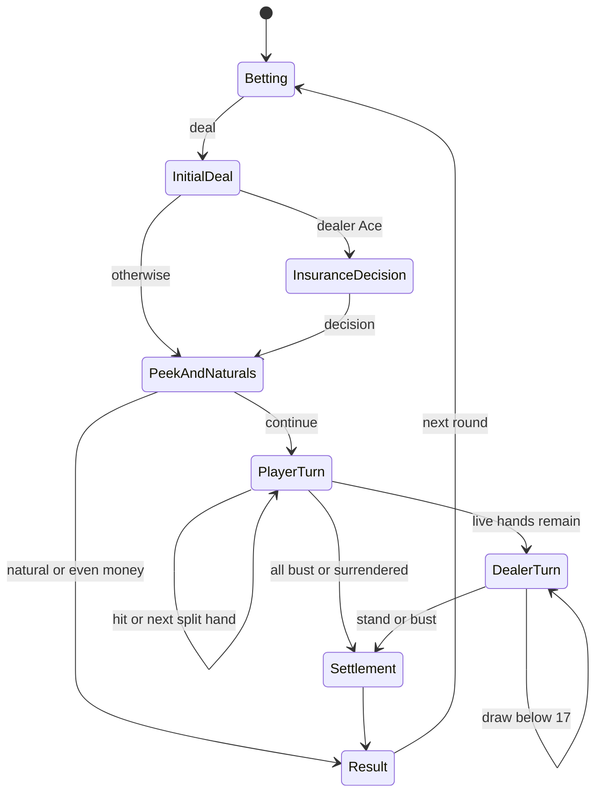

# 블랙잭 기술 설계

**목적:** 현재 구현된 블랙잭의 엔진, 게임 명령, 공개 상태, 세션 저장과 화면 계약을 정의한다.

**요약:** 순수 TypeScript 블랙잭 규칙과 정산, Main의 `GameStore`·`SessionRepository`, 베팅·플레이 화면과 검증 기준을 다룬다. 오버레이 창·플랫폼·IPC 신뢰 경계·패키징은 [메인 기능 기술 설계](../../main/technical-design.md)가 담당한다. 카지노 규칙의 기준은 [블랙잭 제품 설계](product-design.md), 현재 파일과 완료 상태는 [블랙잭 구현 현황](implementation-status.md)을 따른다.

## 목차

- [1. 현재 코드 경계](#1-현재-코드-경계)
- [2. 게임 명령과 공개 상태](#2-게임-명령과-공개-상태)
- [3. 순수 게임 엔진 계약](#3-순수-게임-엔진-계약)
- [4. 명령 직렬화와 세션 저장](#4-명령-직렬화와-세션-저장)
- [5. 게임 화면과 입력](#5-게임-화면과-입력)
- [6. 검증과 완료 기준](#6-검증과-완료-기준)
- [7. 공용 게임 상태로의 전환](#7-공용-게임-상태로의-전환)

## 1. 현재 코드 경계

현재 블랙잭은 `src/core/`의 규칙·점수·슈·정산, `src/main/game/game-store.ts`의 단일 작성자, `src/main/persistence/session-repository.ts`의 블랙잭 세션 스키마, `src/shared/contracts.ts`의 `GameViewState`·`UserAction`, `src/renderer/main.tsx`의 게임 화면으로 연결된다. 결정론적 카드 픽스처는 `fixtures/blackjack/`에 있다. Main·Preload·Renderer의 프로세스 경계는 [메인 기술 설계](../../main/technical-design.md#3-프로세스와-모듈)에 있다.

`GameStore`의 revision·명령 직렬화와 `SessionRepository`의 원자 저장·백업 방식은 향후에도 참고할 수 있다. 그러나 현재 타입과 유효성 검사는 `SessionState`, 블랙잭 카드·핸드, `RULE_SET_ID`에 직접 연결돼 있다. 이 코드가 이미 다른 게임의 세션을 처리하는 공통 저장 계층이라는 의미로 해석하지 않는다. Renderer의 `window.blackjack` API 이름도 현재 구현 그대로다.

Main만 완전한 게임 상태를 소유한다. Renderer에는 딜러 비공개 카드, 남은 슈, 내부 원장을 포함한 전체 `SessionState`를 보내지 않는다. 공개용 `GameViewState`와 결과 상세만 전달하고, Renderer reload가 게임 세션을 초기화하지 않는다. 네트워크·LLM 호출 없이 로컬에서 플레이한다.

## 2. 게임 명령과 공개 상태

`src/shared/contracts.ts`가 실제 채널 이름, Zod 스키마, TypeScript DTO의 기준이다. 게임 채널은 `game:get-snapshot`, `game:command`, `game:state`, `game:recovery`다. `getSnapshot()`과 `onState()`가 공개 `GameViewState`를 전달하고, `dispatch()`는 `commandId`, `expectedRevision`, 판별된 `UserAction`을 받는다. `recover()`는 손상·미래 스키마 저장을 발견했을 때 백업 복원 또는 새 게임을 선택한다. 딜러 진행·셔플·정산·파일 경로는 Renderer용 명령이 아니다.

상태 구독을 먼저 설치하고 snapshot을 요청하며 더 큰 revision을 적용한다. 같은 revision의 복구 완료·저장 실패 표시 갱신은 허용하고 낮은 revision은 버린다. 응답과 push가 역순으로 와도 이전 화면으로 돌아가지 않는다. IPC sender·최상위 문서·허용 URL 검사와 raw IPC 제한은 [메인 기술 설계](../../main/technical-design.md#5-창-상태와-ipc-신뢰-경계)가 기준이다.

## 3. 순수 게임 엔진 계약

### 3.1 금액과 명령

```ts
type Cents = number; // 모든 경계에서 safe integer 검증
interface UserCommand {
  commandId: string;
  expectedRevision: number;
  action: UserAction;
}
// UserAction은 type을 판별자로 갖는 union:
// setBet, setBetStep, deal, chooseInsurance, acceptEvenMoney,
// keepBlackjack, hit, stand, doubleDown, split, surrender,
// nextRound, resetSession, retrySave
// InternalAction: advanceDealer (Main 전용)
```

- 모든 금액·revision은 Number.isSafeInteger로 검증한다. 돈은 정수 센트이며 소수 달러를 내부 계산에 쓰지 않는다.
- 곱셈·덧셈의 중간 결과도 safe integer인지 확인하고 범위를 넘으면 명령을 거부한다. 무제한 누적 잔액 때문에 number 정밀도를 잃지 않게 한다.
- JSON 호환성을 위해 초기 구현은 bigint를 쓰지 않는다.
- S10.5부터 잔액이 100센트 이상일 때 기본 베팅은 정수 센트로 $1.00~현재 사용 가능 잔액이며 1센트 단위 직접 입력을 허용한다. 입력 문자열은 십진수로 파싱해 센트로 정확히 변환한다. 소수 셋째 자리·지수 표기·부호·빈 값·숫자가 아닌 값은 거부하고 입력 자체를 반올림하지 않는다. 기존 −/+ 증감 단위와 보험 $0.50 단위는 유지한다.
- 현재 베팅액이 잔액을 넘으면 다음 판에 최대 센트 금액으로 낮춘다. 정산 후 잔액이 100센트 미만이면 게임 오버로 `nextRound`·`setBet`·`setBetStep`·`deal`을 거부하고 새 게임만 허용한다. 정확히 100센트면 `nextRound` 이후 $1.00 베팅과 딜을 허용한다. 진행 중인 라운드는 잔액이 100센트 미만이 되어도 정산한다. 저장된 베팅 전 상태의 잔액이 100센트 미만인 경우에도 같은 정책을 적용한다. 게임 오버는 잔액에서 파생한 UI 상태이며 앱 프로세스 종료나 별도 저장 phase가 아니다.
- 기존 정수 달러 베팅 세션은 그대로 유효하다. 새 센트 베팅을 엔진의 `legalActions`·무결성 검사·저장 복구 검증에도 일관되게 허용하고, 기존 저장 세션을 소리 없이 초기화하지 않는다.
- RuleSet.id는 `casino-6d-s17-3to2-v1`. 진행 중 규칙은 버전 고정한다.
- phase·activeHandId·revision을 검증한다. UI 버튼 비활성화는 엔진 검사를 대체하지 않는다.

### 3.2 순수 전이

`transition(state, command, environment): TransitionResult`는 nextState와 events를 반환한다. Electron, DOM, 타이머, 파일 API에 의존하지 않는다. legalActions도 엔진에서 계산한다.

슈 생성은 Main의 `node:crypto.randomInt`를 주입해 Fisher–Yates를 실행한다. 테스트는 고정된 카드 순서와 ID 공급원을 주입한다. 난수는 Renderer나 CSS 애니메이션에서 생성하지 않는다.



최초 배분은 결정 가능한 선택 지점까지 하나의 전이로 처리한다. 딜러 드로우만 필요에 따라 한 장당 내부 명령으로 나눈다. 금액 정산은 애니메이션 완료 여부와 무관하다.

### 3.3 카지노 규칙 구현 경계

카지노 규칙 자체(보험/이븐 머니 순서, 자연 블랙잭 예외, 스플릿 4핸드 제한과 A 재스플릿 금지, 서렌더 조건, 딜러 S17, 슈 유지와 재셔플 시점)는 [블랙잭 제품 설계의 게임 규칙](product-design.md#3-게임-규칙-카지노식-6덱-테이블)이 기준이며 여기서 다시 서술하지 않는다. 이 절은 규칙을 코드로 옮길 때 필요한 구현 결정만 다룬다.

- 재스플릿마다 `activeHandIndex`와 `handId`를 갱신해 왼쪽 우선 진행 순서를 상태로 표현한다.
- 딜러 드로우는 비교 대상이 되는 살아 있는 플레이어 핸드가 없으면 실행하지 않는다.
- unexpected deck exhaustion(슈 소진 중 카드 부족)은 무작위 재셔플로 덮지 않고 무결성 오류로 중지한다.

### 3.4 정산

| 결과 | 반환 센트 계산 |
| --- | --- |
| 일반 승리 | handWager × 2 |
| 자연 블랙잭 | originalWager × 5 / 2 |
| 무승부 | handWager |
| 패배·버스트 | 0 |
| 서렌더 | originalWager / 2 |
| 보험 적중 | insuranceWager × 3 |
| 이븐 머니 | originalWager × 2 |

3:2 자연 블랙잭과 절반 반환 서렌더에서 반환금이 반 센트가 되면 정수 산술로 가장 가까운 센트로 반올림하고, 정확히 반 센트는 올림한다. 예를 들어 $1.01 베팅의 자연 블랙잭 총 반환금 $2.525는 $2.53, 서렌더 반환금 $0.505는 $0.51이다. 그 밖의 배당은 정수 센트로 계산하고 원장에는 반올림 완료된 반환금만 기록한다. 보험은 즉시 정산할 수 있고 핸드는 마지막에 정산한다. 원장 키는 `(roundId, componentId)`이며 componentId는 insurance 또는 handId다. 이미 존재하는 키는 다시 잔액에 반영하지 않는다.

라운드 순손익 = 모든 반환 합계 − 기본 베팅 − 보험 − 더블 추가금 − 스플릿 추가금. 스냅샷에는 차감 내역도 보존해 복원 후 계산할 수 있게 한다.

### 3.5 P1 구현 계약

P1 구현은 `src/core` 아래의 JSON 호환 readonly 데이터와 순수 전이로 확정했다.

- `Shoe`는 `{ cards, nextIndex }`이며 draw는 다음 Shoe를 반환한다. 슈 생성은 `randomInt(maxExclusive)`를 필수로 주입받고 코어가 OS 난수나 `Math.random`을 직접 호출하지 않는다.
- `SessionState`는 ruleSet, balance, pending bet, bet step, shoe, current round, ledger, last result를 가진다. revision과 처리한 command ID는 S07 `GameStore`가 감싼다.
- 저장 가능한 phase는 `betting | insuranceDecision | playerTurn | dealerTurn | result`다. `initialDeal`, `peekAndNaturals`, `settlement`는 단일 transition 내부에서 끝나는 일시적 단계라 스냅샷에 남기지 않는다.
- 최초 pending bet은 테이블 최소와 같은 $1이다. 보험 거절은 `chooseInsurance`의 0센트로 표현하고, hit/stand/double/split/surrender는 모두 `handId`를 받는다.
- 상태 전후에 safe integer, 312장/6덱 구성·슈 인덱스·카드 ID와 소비 prefix, phase/active hand, 원장 키·net·last result 일관성을 검사한다. 새 세션·reset·재셔플 공급원은 `nextIndex: 0`이어야 하며, 예상 밖 슈 소진은 `INTEGRITY_ERROR`로 중지한다.

구현과 P1 검증 범위는 [P1 보고서](../../session-reports/P1-blackjack-core.md)에 기록한다.

## 4. 명령 직렬화와 세션 저장

### 4.1 단일 작성자

Main의 GameStore만 committedState를 소유한다. Node가 단일 스레드여도 await 사이에 다른 IPC가 들어오므로 busy와 명시적 직렬 실행 경로가 필요하다.

1. commandId 중복을 먼저 검사한다. 현재 세션의 직전 처리 ID·결과는 저장하고 최근 결과 캐시도 둔다. 재전송이면 이미 처리된 결과를 돌려준다.
2. busy 또는 expectedRevision 불일치면 각각 BUSY/STALE_STATE를 반환한다. 실패한 클릭을 임의로 큐에 쌓아 나중에 실행하지 않는다.
3. busy를 동기적으로 설정하고 committedState 복사본에 전이를 계산한다.
4. nextState와 revision 증가·처리 ID·원장 변경을 하나의 스냅샷으로 저장한다.
5. 저장 성공 후에만 committedState를 교체하고 공개 상태를 push한다.
6. 저장 실패 시 이전 committedState를 유지한다. 계산된 pendingTransition을 보존하고 같은 내용으로 재시도한다. 새 슈를 다시 섞거나 카드를 다시 뽑지 않는다.
7. busy를 해제하고 딜러 phase라면 창 표시 상태와 무관하게 다음 내부 명령을 한 번 예약한다.

오래된 commandId가 캐시에서 사라졌어도 revision 검사가 중복 실행을 막는다. Renderer가 멈추거나 응답을 놓쳐도 저장된 판이 기준이다. InternalAction도 동일한 직렬 경로를 통과하며 Renderer에서 호출할 수 없다.

### 4.2 저장 형식

`app.getPath('userData')` 아래 `session.json`, `session.backup.json`을 사용한다. 제품 표시명 변경과 무관하게 저장 경로 식별자를 고정한다. LocalStorage/IndexedDB에는 게임 원장을 저장하지 않는다. 창 표시 설정용 `preferences.json`은 만들지 않는다.

Session에는 schemaVersion, revision, ruleSetId, balanceCents, pendingBet, betStep, shoe, round, ledger, lastResult, lastAppliedCommand가 포함된다. shoe는 312장 순서와 소비 인덱스, round는 보험 결정·정산 상태·핸드별 베팅·상태·활성 ID를 보존한다.

S08 구현은 최상위 `{ schemaVersion: 1, revision, state, lastAppliedCommand }` wrapper를 사용한다. `state`가 위 게임 필드 전체를 담고 `lastAppliedCommand`는 `{commandId, revision}` 또는 `null`이다. 저장 실패 시 동일한 후보 스냅샷을 보존해 같은 ID 재전송이나 `retrySave`로 재시도하며, 저장 성공 전에는 revision·공개 화면을 변경하지 않는다. 복원 직후 `dealerTurn`이면 저장된 상태에서 내부 행동을 한 단계씩 다시 진행한다.

- 같은 폴더의 임시 파일을 새로 생성해 JSON 기록 → 파일 sync → close → 기존 파일 교체 순으로 처리한다.
- 이전에 검증된 주 파일은 backup 임시 파일을 통해 교체한다. 주 파일을 먼저 삭제하는 방식은 사용하지 않는다.
- rename/교체의 세부 동작은 macOS·Windows에서 검증한다. Windows 잠금·EPERM에는 제한된 재시도를 하고 계속 실패하면 게임 입력을 멈춘다.
- 임시 파일은 주 파일과 같은 볼륨에 둔다. 전원 차단에 대한 완전한 내구성을 rename만으로 보장하지 않는다.
- primary/backup은 스키마뿐 아니라 카드 ID·슈 인덱스·잔액·원장·phase 일관성을 검사한다. 남은 tmp 파일을 임의의 최신 상태로 승격하지 않는다.
- 손상 시 백업 복구를 안내하고, 미래 schemaVersion이면 원본을 보존한다. 자동 초기화하지 않는다.
- S08에서는 손상/미래 버전 primary를 발견하면 recovery 화면에서 입력을 막고 백업 복구 또는 새 게임을 명시적으로 선택하게 한다. 선택한 후 덮어쓰기 전에 원본 primary를 `session.recovery-<UUID>.json`으로 복사한다. 백업이 유효하지 않으면 백업 버튼은 제공하지 않는다.
- 저장 중 정상 종료 요청은 완료를 기다린다. 실패하면 오류를 표시하고 재시도/종료 선택을 제공한다.

창 표시 설정의 실행 중 수명과 재실행 초기화 목표는 [메인 기술 설계](../../main/technical-design.md#5-창-상태와-ipc-신뢰-경계)를 따른다. 게임에 영향을 주는 pendingBet·betStep, 진행 중 판·잔액은 이 세션 파일에서 복원한다. 저장 파일은 평문이므로 딜러 카드 은닉은 UI 경계이며 부정행위 방지는 범위 밖이다.

## 5. 게임 화면과 입력

| 컴포넌트 | 데이터 / 역할 |
| --- | --- |
| DealerRow | 공개 카드 또는 ?, 공개 정보 기준 합계 |
| PlayerHandView | 활성 핸드 카드·소프트 합계·베팅·핸드 번호 |
| BetControl | −/+, 현재 금액, 증감 단위, 딜. S10.5에서 금액 숫자칸을 같은 자리의 텍스트 필드로 전환 |
| InsuranceControl | 50센트 증감, 구매/거절 또는 이븐 머니/유지 |
| ActionBar | 히트/스탠드/더블, 스플릿·서렌더 메뉴 |
| ResultView | 라운드 순손익, 상세 원장 팝오버, 다음 판 |

- [메인 기능의 최소 글씨·클릭 영역 기준](../../main/product-design.md#2-오버레이와-조작)을 지키면서 카드와 행동을 배치한다.
- 최소 크기 220×150에서는 Header 24 / Balance 22 / Card 28 이상 / Action 24 / Status 14 DIP와 간격을 예산으로 둔다. 메인 기능의 불투명도 조절창은 이 게임 행의 레이아웃을 차지하지 않는다. 실제 폰트로 레이아웃 검증 후 미세 조정한다.
- 카드가 많으면 카드 행만 스크롤한다. 합계와 액션은 고정한다.
- 스플릿 핸드를 세로로 전부 펼치지 않는다. 활성 핸드와 나머지 핸드의 요약만 표시한다.
- 결과와 오류는 흑백 텍스트로 표현하고 접근성 라벨을 제공한다. 한글 이름과 카드 문양의 글꼴 폴백을 확인한다.

헤더의 드래그·색상·숨기기·종료 조작과 접힌 창의 펼치기 동작은 [메인 기술 설계](../../main/technical-design.md#5-창-상태와-ipc-신뢰-경계)가 맡는다. 현재 헤더의 잔액·게임 이름과 접힌 막대의 잔액·진행 상태 문구는 블랙잭 `GameViewState`에서 만든다.

베팅 금액 숫자칸을 누르면 같은 자리에 텍스트 필드를 연다. 현재 베팅액을 채우고 명시적 편집 동안에만 Main에 임시 키보드 포커스를 요청한다. Enter는 정확히 센트로 파싱한 유효 금액을 `dispatch(setBet)`으로 확정하며, 저장된 새 상태를 받은 뒤 숫자칸으로 돌아간다. Escape와 필드 밖 클릭은 초안을 버리고 이전 금액을 표시한다. 빈 값·문자·부호·지수 표기·소수 셋째 자리·범위 밖 값은 오류를 보여 주고 편집을 유지한다. 편집 중에는 딜을 막는다.

확정·취소·창 blur·숨김·접힘·클릭 통과·Renderer reload·베팅 phase 종료 때 편집을 끝낸다. 중복 요청이나 게임 명령과 겹침은 Main에서 검사한다. 금액 필드는 220×150 DIP의 기존 베팅 행 안에 있어야 한다. 창 포커스 정책과 불투명도 조절창은 [메인 기술 설계](../../main/technical-design.md#4-창-구현과-os별-처리)를 따른다.

## 6. 검증과 완료 기준

- 코어: A 여러 장, S17, 자연/스플릿 21, 양쪽 블랙잭, 보험 전 피크 금지, 이븐 머니·서렌더, 4핸드·A 제한·DAS, 혼합 승패.
- 금액: $1 베팅의 3:2·보험 $0.50·서렌더 $0.50, $1.01·$1.25 직접 입력과 반 센트 반환금 반올림, 베팅 상한·증감·잔액 부족, safe integer 경계. 정산 후 잔액 $1.00에서는 다음 판 가능, $0.99에서는 게임 오버, 진행 중 판은 정산 완료되는지 검증한다.
- 원장: 동일 commandId 재전송, 같은 revision 동시 명령, 오래된 handId, 보험 중복 지급, await 중 재진입.
- 슈: 312개 고유 ID, 75% 컷, 판 사이 유지, 판 중 재셔플 금지.
- 복원: 보험 정산 직후, 스플릿 사이, 딜러 카드 직후, 정산 전후, 저장 성공 후 응답 유실.
- 실패 주입: 쓰기 실패·파일 잠금·손상·미래 schema·백업 복구·저장 중 종료.
- 게임 IPC: 알 수 없는 `UserAction`, 내부 딜러 명령 위조, 비정상 금액, Renderer에 홀 카드·슈 미전달.
- 게임 상태 구독: snapshot과 push 순서 역전, 재로드 뒤 최신 게임 revision 적용, 같은 revision의 복구·저장 오류 갱신.

Vitest로 순수 엔진·세션 저장·게임 명령 검증을 수행한다. 실제 앱을 거치는 대표 플레이·복원 경로는 [블랙잭 E2E 테스트 설계](e2e-test-plan.md)를 따른다.

창 입력·크기 조절·실제 OS 합격 조건은 [메인 기술 설계](../../main/technical-design.md#8-검증과-완료-기준)를 따른다.

P1/P2는 과거 구현 단계 표기다. 2026-09-18 이후 잔여 단계의 일괄 완료 계획은 폐기했다. 실제 실행 순서는 [작업 세션 로드맵](../../work-session-roadmap.md), 사용자 여정 시나리오는 [블랙잭 E2E 테스트 설계](e2e-test-plan.md)를 따른다.

숨김·클릭 통과·Renderer 장애·앱 재실행 후에도 같은 카드와 잔액을 복원하고 블랙잭 규칙 전체를 플레이할 수 있어야 한다. Renderer 장애 후 새 창 재생성은 미구현이며 실제 영향은 N01에서 평가한다. 현재 상태는 [블랙잭 구현 현황](implementation-status.md)을 확인한다.


## 7. 공용 게임 상태로의 전환

**신규·미구현:** N02에서 [메인 기술 설계 §9](../../main/technical-design.md#9-여러-게임과-공용-잔액의-신규-계약)의 공용 작성자·잔액·v2 저장·앱 API를 연결한다. 위 §1~5의 GameStore·v1 저장·window.blackjack은 현재 구현 경계를 기록한다. 전환 후 앱 공통 소유권과 저장 계약은 메인 문서가 기준이다.

기존 순수 규칙은 공용 잔액을 주입하는 어댑터로 활용하고 결과 잔액과 게임 상태를 함께 커밋한다. `resetSession`을 게임 전용 공개 초기화로 유지하지 않는다. 새 시작은 앱의 `resetAll`로 라우팅하며 진행 중 직접 IPC 초기화도 차단한다.

이미 정산된 과거 판은 결과·원장을 보존한다. 다른 게임에서 돈을 사용한 뒤 돌아오면 새 베팅 설정만 현재 잔액에 맞춘다. 미완료 판의 이관은 이미 차감된 베팅·보험/스플릿/더블 상태를 그대로 보존해 재차감하지 않는다. 새로운 바카라 규칙 때문에 기존 6덱·S17·3:2 계약을 바꾸지 않는다.
