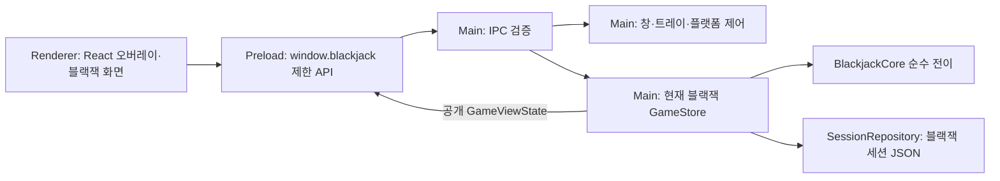

# molsino 메인 기능 기술 설계

**목적:** 게임 화면을 담는 Electron 앱의 창, 입력, 프로세스, IPC 신뢰 경계와 배포 계약을 정의한다.

**요약:** macOS·Windows 공통 오버레이와 플랫폼 정책, Main·Preload·Renderer 경계, 창 상태, 검증 목표를 다룬다. 현재 앱은 블랙잭 하나만 연결되어 있으며 게임 명령·상태·저장 스키마는 [블랙잭 기술 설계](../games/blackjack/technical-design.md)가 담당한다. 사용자 동작은 [메인 기능 제품 설계](product-design.md), 현재 파일과 완료 상태는 [메인 구현 현황](implementation-status.md)을 따른다.

## 목차

- [1. 기술 선택과 책임 경계](#1-기술-선택과-책임-경계)
- [2. 오버레이 경험 참고](#2-오버레이-경험-참고)
- [3. 프로세스와 모듈](#3-프로세스와-모듈)
- [4. 창 구현과 OS별 처리](#4-창-구현과-os별-처리)
- [5. 창 상태와 IPC 신뢰 경계](#5-창-상태와-ipc-신뢰-경계)
- [6. Electron 실행 경계](#6-electron-실행-경계)
- [7. 프로젝트 구조와 패키징](#7-프로젝트-구조와-패키징)
- [8. 검증과 완료 기준](#8-검증과-완료-기준)

## 1. 기술 선택과 책임 경계

macOS와 Windows에서 Electron, TypeScript, React UI, Forge·Vite 빌드를 공유한다. macOS에서 먼저 확인하되 Windows도 빌드·검증 대상으로 둔다. 실제 사용 버전은 `package.json`과 `package-lock.json`이 기준이다.

| 계층 | 현재 선택 | 역할 |
| --- | --- | --- |
| Electron Main | Electron + Node.js | 앱 수명, 단일 인스턴스, 창·트레이, IPC, 현재 게임 저장 연결 |
| Preload | sandbox + contextBridge | Renderer에 제한된 메서드와 구독만 노출 |
| Renderer | React + CSS | 오버레이와 현재 블랙잭 화면, 일시적인 입력 초안 |
| 플랫폼 | `src/main/platform/adapter.ts` | macOS·Windows 창 정책의 차이 처리 |
| 계약 검증 | Zod | 창 명령과 게임 명령의 런타임 검증 |
| 패키징·테스트 | Electron Forge + Vite, Vitest, Playwright Electron | OS별 산출물과 자동 검증 |

현재 `src/main/main.ts`는 오버레이와 블랙잭 `GameStore`를 직접 연결한다. `window.blackjack` Preload API, `game:*` IPC 채널, `SessionRepository`도 현재 블랙잭 데이터에 결합돼 있다. 이 경계는 앞으로 여러 게임을 수용하도록 추상화됐다는 뜻이 아니다. 게임별 상태와 규칙의 실제 계약은 [블랙잭 기술 설계](../games/blackjack/technical-design.md)에 둔다.

초기 검증 목표는 macOS 14 이상 arm64와 Windows 11 x64다. 지원 범위는 채택한 Electron 버전과 실제 장비 검증을 함께 확인해 표기한다. 다른 CPU·OS 조합은 별도 검증이 필요하다. Electron은 여러 프로세스를 사용하지만 현재 실행 인스턴스와 블랙잭 세션 상태의 소유자는 각각 하나다.

## 2. 오버레이 경험 참고

### 2.1 공식 문서에서 확인한 펫 동작

ChatGPT 데스크톱의 펫은 macOS와 Windows에서 다른 앱 위에 떠 있고, 드래그 이동·크기 설정·숨기기·위치 복원을 지원한다. OS의 동작 줄이기 설정도 따른다. 이 사용자 경험을 기준으로 삼는다. [OpenAI 공식 Pets 문서](https://learn.chatgpt.com/docs/pets)

### 2.2 설치된 앱에서 읽기 전용으로 확인한 구현 단서

조사 대상은 `/Applications/ChatGPT.app/Contents/Resources/app.asar`이며 번들 식별자는 `com.openai.codex`였다. 패키지 목록과 관련 코드 구간만 읽었고 설치 파일을 변경하지 않았다.

| 관찰 위치 / 심볼 | 확인한 내용 | molsino에 적용할 원리 |
| --- | --- | --- |
| `webview/assets/pet-content-*.js`, `pet-model-*.js` | 펫 화면·모델용 번들 존재 | 창 계층과 화면 상태를 분리 |
| `.vite/build/main-DaMR-wdT.js`, `avatar-overlay` | Electron BrowserWindow 기반 오버레이 제어 코드 | 일반 메인 창과 다른 수명·입력 정책 |
| `showWindow`, `showInactive` | 비활성 상태로 오버레이 표시 | 복원 시 업무 창의 포커스 유지 |
| `setAlwaysOnTop(..., floating)`, `setVisibleOnAllWorkspaces` | 창 레벨과 작업 공간 처리 | 상단 표시와 Spaces 정책을 별도 관리 |
| `setPointerInteraction`, `setKeyboardInteraction` | 마우스와 키보드 상호작용을 각각 관리 | 클릭 수신과 키보드 포커스를 분리 |
| `setIgnoreMouseEvents`와 forwarding 분기 | 클릭 통과 전환 및 이동 이벤트 처리 | 클릭 통과 상태에서도 복구 경로 필요 |
| `isInputShapeSupported`, `setInputShape` | 입력 영역 지원 여부에 따른 분기 | 선택적 클릭 통과는 OS 기능 확인 후 적용 |
| `displayId`, `anchor`, 드래그·화면 변경 처리 | 화면과 기준점 중심의 위치 관리 | 다중 모니터와 위치 복원 모델 |

이 표는 **설치된 특정 빌드의 정적 관찰**이다. 공개 API 계약이나 모든 버전의 구현을 의미하지 않는다. `setInputShape`가 일반 배포 Electron 에서 동일하게 사용 가능하다고 가정하지 않는다. 펫 전체 소스나 내부 로직을 복제하지 않고 공개 OS API로 같은 동작을 구현한다.

### 2.3 이번 구현에 적용하는 결정

펫에서 확인한 비활성 표시, 포인터와 키보드 입력 분리, 위치 기준점 관리 원리를 Electron 공개 API로 구현한다. 설치된 앱의 커스텀 런타임·내부 모듈·펫 이미지에 의존하지 않는다.

- Main이 창·입력 정책을 관리하고 Renderer가 현재 게임의 화면을 그린다.
- 현재 블랙잭 화면과 TypeScript 엔진은 두 OS가 동일한 소스를 사용한다.
- OS별 차이는 PlatformAdapter에 모은다. Swift/C# 엔진이나 별도 UI 포팅은 계획하지 않는다.
- 기본적으로 네이티브 애드온 없이 시작한다. 공개 API만으로 핵심 요구를 충족하지 못하는 경우에만 작은 창 제어 브리지를 검토한다.
- Chromium·Node가 포함되는 만큼 설치 크기와 전체 프로세스 메모리를 측정한다. 작은 창이라는 이유로 작은 메모리 사용을 보장하지 않는다.

## 3. 프로세스와 모듈



| 현재 코드 | 담당 책임 |
| --- | --- |
| `src/main/main.ts` | 앱 수명, 오버레이·조절창·트레이, IPC 등록, 현재 블랙잭 세션 연결 |
| `src/main/windows/`, `src/main/platform/adapter.ts` | 창 크기·숨김 단축키와 OS별 창 정책 |
| `src/main/ipc/trust.ts` | 등록된 최상위 창과 허용된 문서 URL 검사 |
| `src/preload/preload.ts` | contextBridge API와 상태 구독·해제 |
| `src/renderer/main.tsx` | 창 조작과 현재 블랙잭 UI가 함께 구현된 Renderer |
| `src/main/game/`, `src/main/persistence/`, `src/core/` | 현재 블랙잭 명령·저장·엔진; [게임 문서](../games/blackjack/technical-design.md)에서 상세 정의 |

모듈을 더 잘게 나눈 `AppCoordinator`, `OverlayWindowController`, `InputPolicyController`, `DisplayPlacementService`, `TrayController`는 초기 설계상의 책임 이름이며 현재 별도 파일로 모두 존재하는 모듈은 아니다. 실제 파일 지도는 [메인 구현 현황](implementation-status.md)을 기준으로 한다. Main은 창과 저장된 게임 상태를 소유하고 Renderer에는 공개 상태만 전한다.

## 4. 창 구현과 OS별 처리

### 4.1 수명과 초기 표시

1. `app.requestSingleInstanceLock()`을 확보한다. 실패하면 종료한다. `second-instance`는 기존 창을 비활성 복원한다.
2. 앱 준비 후 현재 블랙잭 세션을 읽고 투명 BrowserWindow, 트레이, 창 단축키를 만든다. 위치·다중 모니터 복원 확장은 보류 상태다.
3. `show:false` 창에 로컬 `app://molsino/index.html` UI를 로드한다. 현재 코드는 `ready-to-show`에서 `showInactive()`를 호출한다.
4. Renderer의 초기 구독·상태 동기화를 완료한 뒤 표시하는 `ui:ready` 절차와 제한 시간·오류 트레이 경로는 후속 설계다. 현재 구현의 표시 시점을 이 목표와 혼동하지 않는다.

닫기는 숨김으로 처리하고 명시적 종료에서만 실제 창을 파괴한다. window-all-closed 이벤트로 자동 종료하지 않는다. 종료 플래그를 사용해 close → hide 루프를 막는다. Tray 객체는 Main에서 강하게 참조해 수명을 유지한다.

### 4.2 BrowserWindow 설정

아래는 **설계용 TypeScript 예시**이며 컴파일·실행 검증된 앱 코드는 아니다. preloadPath와 protocol 핸들러는 빌드 결과에 맞춰 초기화한다.

```ts
const overlay = new BrowserWindow({
  width: 280, height: 180,
  frame: false,
  transparent: true,
  backgroundColor: '#00000000',
  hasShadow: false,
  alwaysOnTop: true,
  focusable: false,
  acceptFirstMouse: true,
  skipTaskbar: true,
  resizable: false,
  minimizable: false,
  maximizable: false,
  fullscreenable: false,
  show: false,
  webPreferences: {
    preload: preloadPath,
    contextIsolation: true,
    sandbox: true,
    nodeIntegration: false,
    webSecurity: true,
  },
});
await overlay.loadURL('app://molsino/index.html');
// 현재 구현은 ready-to-show에서 overlay.showInactive()를 호출한다.
```

Windows 투명 창은 frameless로 구성한다. `focusable: false`와 `showInactive()`를 조합한다. 현재 블랙잭 베팅 입력만 명시적 요청 동안 임시 포커스를 허용한다. 상세 입력 조건은 [블랙잭 기술 설계](../games/blackjack/technical-design.md#5-게임-화면과-입력)를 따른다. [Electron 창 API](https://www.electronjs.org/docs/latest/api/base-window)

루트 HTML·body·React root 배경도 transparent로 둔다. CSS opacity는 정보 레이어에만 적용하고 창 전체 알파는 1로 유지한다. 펼친 창의 우측 상단 색상 전환 버튼에 호버하면 작은 별도 조절창이 나타나며, 그 슬라이더는 전경 불투명도를 20–100%(5% 단위, 기본 65%)로 조절한다. 20%는 완전 비표시를 막는 하한이며 배경 알파를 높이는 설정이 아니다. 조절창은 버튼의 좌우 여유와 현재 display의 workArea를 기준으로 위치를 선택하고 최종 bounds를 화면 안에 보정한다. 버튼↔조절창 사이 이동에는 짧은 닫힘 지연을 둔다. 슬라이더 조작 중에는 선택값을 즉시 미리 보고, 게임 창 일반 호버 시 100%·이탈 0.8초 후 선택값으로 돌아간다. 흐림 효과나 그림자로 배경을 채우지 않는다. 화면 확대율은 1로 고정하고 OS DPI를 별도로 처리한다.

### 4.3 플랫폼별 최소 분기

| 항목 | macOS | Windows |
| --- | --- | --- |
| 상단 표시 | setAlwaysOnTop(true, 'floating') | setAlwaysOnTop(true) |
| 작업 공간 | `setVisibleOnAllWorkspaces(true, { visibleOnFullScreen: true })` 호출 중. 실제 Spaces·전체 화면 결과는 OS에서 확인 | 같은 API는 효과 없음. 현재 가상 데스크톱 정책 사용 |
| 복원 | showInactive, 일반 앱 Dock 표시·E2E 전용 숨김 | showInactive, skipTaskbar |
| 트레이 | 단색 Template 이미지, 메뉴 막대 | ICO, 알림 영역 메뉴 |
| 현재 블랙잭 금액 편집 | 명시적 클릭 중에만 메인 창 `setFocusable(true)`·`focus()` | 동일 창 정책 |
| 전체 화면 | Spaces·Stage Manager 확인 | 일반 전체 화면과 독점 전체 화면을 구분 |

공통 상단 표시 기능이 모든 전체 화면·가상 데스크톱에서 같은 결과를 보장하지는 않는다. Windows의 모든 가상 데스크톱에 고정하는 기능은 1차 범위 밖이다. 다른 앱 전체 화면에서 보이지 않을 때도 트레이로 접근 가능해야 한다.

macOS의 프로덕션 Dock 정책은 별도로 유지한다. 프로덕션 패키지를 반복 실행하는 Playwright E2E에만 `MOLSINO_TEST_HIDE_DOCK=1`을 전달하여 `setVisibleOnAllWorkspaces` 이후 `app.dock.hide()`를 한 번 호출하고, `app.dock.isVisible()`로 숨김을 검증한다. 앱 종료 후 OS Dock 항목을 강제로 조작하거나 사용자 Dock 설정을 바꾸지 않는다. 테스트 프로세스의 정상 종료와 Dock 노출은 서로 다른 검증 대상이다. [Electron Dock API](https://www.electronjs.org/docs/latest/api/dock)

### 4.4 포커스와 입력 정책

- 기본 오버레이는 마우스 중심이다. 복원·호버·일반 게임 버튼 클릭에서 `focus()` 또는 `app.focus()`를 호출하지 않는다.
- 창 제어 예외인 전역 Alt+백틱은 Electron Main의 `globalShortcut`으로 앱 준비 후 등록한다. 콜백 `toggleOverlay()`는 보이는 상태면 숨기고, 숨김 상태면 트레이 복원과 같은 `reveal()`(`showInactive`)을 호출한다. 게임 명령·일시정지·키보드 포커스 변경은 없다. 등록 실패는 경고만 남기고 트레이 경로를 유지하며 종료 시 해제한다. 키보드 배열·OS별 실제 조합은 실장비에서 확인한다. [Electron globalShortcut](https://www.electronjs.org/docs/latest/api/global-shortcut), [Accelerator](https://www.electronjs.org/docs/latest/api/accelerator)
- `acceptFirstMouse`는 macOS의 비활성 첫 클릭을 위한 설정이다. 아래 앱으로 클릭을 통과시키는 설정과 구분한다.
- 현재 임시 키보드 포커스는 블랙잭 베팅액 편집에만 연결돼 있다. Main은 신뢰된 메인 창·베팅 phase·펼침·대화형 상태를 검사하고 `setFocusable(true)`와 `focus()`를 호출한다. 편집 종료·창 blur·숨김·접힘·클릭 통과·reload·phase 변경 때는 `blur()` 뒤 `setFocusable(false)`로 돌아온다. 이전 업무 앱을 강제로 활성화하지 않는다. 금액의 파싱·확정·취소와 게임 명령 조건은 [블랙잭 기술 설계](../games/blackjack/technical-design.md#5-게임-화면과-입력)에 둔다. [Electron BaseWindow 포커스 API](https://www.electronjs.org/docs/latest/api/base-window)
- 키보드·VoiceOver·Narrator용 별도 접근성 창은 후속 설계다. 현재 제공 기능으로 간주하지 않는다.

비활성 오버레이의 버튼이 첫 클릭에 실행되고 업무 입력 포커스가 유지되는지는 양쪽 OS에서 확인할 조건이다.

### 4.5 클릭 통과

**1차 필수:** 명시적인 전체 창 클릭 통과. `setIgnoreMouseEvents(true)`를 사용하고 해제는 Tray에서 수행한다. 현재 블랙잭 인라인 편집과 드래그를 먼저 종료한다. `pointer-events:none`이나 투명 CSS만으로 다른 앱에 클릭이 전달되지는 않는다. [Electron 클릭 통과와 드래그](https://www.electronjs.org/docs/latest/tutorial/custom-window-interactions)

**선택적 자동 통과:** 컨트롤 외 부분을 통과시키는 실험 기능이다.

- Renderer가 안정적인 컨트롤 직사각형 목록과 layoutRevision을 보고한다. 숨겨진 메뉴·잘린 카드 영역은 제외한다.
- `setIgnoreMouseEvents(true, {forward:true})`로 이동 이벤트를 전달하는 패턴을 검증한다. forward는 모든 클릭·키보드 이벤트 전달을 의미하지 않는다.
- pointer 상태 변경 요청은 프레임과 layoutRevision을 검증한다. 드래그·리사이즈 중에는 interactive를 고정한다.
- 빠른 진입 후 첫 클릭, 스크롤, Renderer 멈춤과 재로드에서 아래 앱으로 오클릭이 새는지 확인한다.
- 통과 상태에서 이벤트가 끊겨도 Tray 복원 경로를 유지한다. 상시 60Hz 전역 포인터 폴링을 기본 구현으로 두지 않는다.
- 로컬 펫의 `setInputShape`는 사용 예정 API가 아니다. 채택한 공식 Electron 릴리스에 존재하고 지원되는 것이 확인될 때 별도 검토한다.

합격 전에는 수동 전체 통과를 기본으로 제공한다. 자동 부분 통과의 미완성은 명시적으로 남기며 수동 모드를 같은 기능으로 설명하지 않는다.

### 4.6 이동과 크기 조절 — P0 우선 검증

상단 드래그 영역은 `app-region: drag`, 버튼·크기 핸들은 `app-region: no-drag`로 구현한다. 드래그 영역의 클릭 이벤트가 게임 명령으로 이어지지 않게 한다.

**제약:** Electron 공식 문서는 투명 창의 일반 리사이즈를 지원하지 않으며 `resizable:true`가 일부 플랫폼에서 투명도를 깨뜨릴 수 있다고 설명한다. 따라서 true로 바꾸는 것만으로 크기 조절을 구현했다고 보지 않는다. [투명 창 제한](https://www.electronjs.org/docs/latest/tutorial/custom-window-styles)

선택한 구현은 `resizable:false`를 유지하고 **사용자 정의 핸들 → IPC → Main의 setBounds**로 크기를 바꾸는 방식이다.

1. 네 모서리 핸들 pointerdown에서 Main이 시작 프레임, 커서 DIP 좌표, 모서리 방향, UUID resizeToken을 기록한다.
2. Renderer는 pointer capture로 update/end/cancel을 보내고, Main은 strict Zod 스키마와 token을 검증한 뒤 시작점 기준 변화량을 적용한다. Renderer 좌표는 IPC로 받지 않는다.
3. 잡은 모서리의 반대편을 고정하고 220×150 ~ 420×280 DIP 및 시작 display의 workArea로 clamp한다. 이벤트는 최신 값만 합쳐 초당 최대 30회 반영한다.
4. Main의 `screen.getCursorScreenPoint()`를 좌표 기준으로 사용해 물리 픽셀·CSS px 혼용을 피한다. 변한 창에 대한 clientX를 누적하지 않는다.
5. pointerup/cancel, 창 숨김, 클릭 통과, 프리셋 변경, navigation/reload, Renderer 종료 시 토큰을 만료시킨다. 10초 inactivity timeout도 둔다.
6. frame 이벤트에서 다시 IPC를 보내 무한 왕복하지 않는다. 최종 bounds를 Renderer에 전달한다.

기본 크기는 280×180 DIP로 통일한다. 메뉴의 작은/기본/큰 프리셋도 활성 resize token을 먼저 만료하고 workArea 안에서 `setBounds`를 적용한다. 프리셋만으로 임의 크기 조절 요구를 충족했다고 처리하지 않는다.

### 4.7 화면 좌표와 복원

일정 결정(2026-09-17): 이 절의 S11 확장 범위(다중 모니터 변화 대응과 전체 창 설정 재실행 초기화)는 TOBE로 보류한다. 아래 내용은 향후 구현 계약으로 유지한다.

- Electron screen의 DIP(device-independent pixel)를 기준으로 창 좌표를 저장한다. zoom=1에서는 UI의 CSS px와 논리 크기를 맞추고 devicePixelRatio를 창 bounds에 곱하지 않는다.
- `screen.getAllDisplays()`, `getDisplayMatching()`, display의 workArea·scaleFactor를 사용한다.
- display-added/removed/metrics-changed에서 위치·배율·창 경계를 재검증한다. [Electron screen](https://www.electronjs.org/docs/latest/api/screen)
- 실행 중에는 현재 displayId, workArea 대비 위치, expandedSize를 보유한다. 앱을 새로 켜면 저장 위치를 읽지 않고 주 화면의 기본 위치·280×180 DIP에서 시작한다.
- 음수 모니터 좌표를 허용한다. 모니터 사이 빈 공간을 유효 화면으로 취급하지 않는다.
- 드래그 중 다른 화면 진입을 허용하고 종료 후 최종 workArea에 맞춘다.
- 위치·크기는 실행 중 메모리에만 보관한다. 정상 종료 시에도 디스크에 저장하지 않는다.
- 접힘 크기는 140×30 DIP, 펼친 크기를 따로 보존한다. 전역 minWidth/minHeight가 접힘을 막지 않도록 상태별 크기 검증을 Main에서 수행한다.

## 5. 창 상태와 IPC 신뢰 경계

### 5.1 창 상태

Main의 현재 `OverlayViewState`는 `revision`, `visibility`(`expanded | collapsed | hidden`), `opacityPercent`, `opacityPopoverVisible`을 가진다. 창 상태는 게임 상태와 별도의 revision으로 구독한다. 접힘 전 펼친 bounds와 숨기기 전 표시 모드는 Main 메모리에 보관하고, 접힘·숨김·클릭 통과로 활성 resize token과 조절창을 정리한다. 헤더의 드래그·색상 전환·숨기기·종료 조작과 접힘/펼침 창 동작은 메인 기능의 책임이다. 현재 헤더의 `BLACKJACK` 표시·잔액과 접힌 막대의 잔액·진행 상태 문구는 블랙잭 공개 상태에서 가져온다. 헤더의 `▁` 접기 버튼은 제거됐지만 `collapsed` 상태·명령은 유지한다. `−`와 Alt+백틱은 같은 숨김 경로로 연결된다.

숨김·접힘은 표시만 바꾼다. 현재 블랙잭의 딜러 진행과 저장은 Main에서 계속되며 복원 시 최신 공개 상태를 다시 보여 준다. 창 표시 설정은 게임 세션과 별개로 실행 중 메모리에 보관한다. 현재 시작값은 주 화면 오른쪽 아래의 280×180 DIP, 흰색 전경, 불투명도 65%, 펼침, 대화형 입력이다. 위치·크기·색상·불투명도·접힘·클릭 통과의 **전체** 재실행 초기화와 다중 모니터 보정은 S11과 함께 보류된 검증 목표다. `preferences.json`은 만들지 않는다.

OS suspend 중에는 실행 자체가 멈출 수 있지만 앱이 별도의 수동 일시정지 상태를 만들지는 않는다.

후속 설계의 통합 창 모델은 현재 공개 상태에 `pointerPolicy`(`interactive | passthrough`), `keyboardMode`(`none | amountEditor | accessibleGame`), 드래그·리사이즈·호버 여부를 더한다. 이 필드들은 아직 현재 `OverlayViewState`의 계약이 아니다. 특히 `accessibleGame`은 접근성 창 후보이고, 임시 금액 편집만 현재 블랙잭에 연결돼 있다.

전경 불투명도는 기본 65%, 20–100%의 5% 단위다. 일반 호버 중 100%로 보여 주고 이탈 0.8초 후 설정값으로 돌아간다. 별도 자식 BrowserWindow인 불투명도 조절창에서 슬라이더를 조작하면 선택값을 즉시 미리 본다. 조절창이 열려 있는 동안에는 일반 호버의 100% 강제를 잠시 해제한다. CSS 전환과 취소 가능한 조절창 닫힘 타이머를 사용하며 `prefers-reduced-motion`에서는 전환을 제거한다. 메뉴·입력창이 열린 동안 정보의 가독성을 유지하는 것이 설계 조건이다. 선택한 불투명도는 실행 중 접힘·펼침과 Renderer reload 뒤에도 유지하고 앱 재실행 시 65%로 시작한다. 조절창은 게임 명령을 받지 않으며, 접힘·숨김·클릭 통과·메인 문서 재로드 때 숨긴다. 전체 포인터·키보드 모드 통합과 자동 부분 클릭 통과는 S12/S13의 후속 범위다.

창이나 메뉴는 호버만으로 펼치거나 접지 않는다. 사용자가 조작하려는 버튼의 위치가 포인터 접근 중 바뀌지 않도록 한다.

### 5.2 채널과 Preload 경계

| 현재 채널 | 방향 | 계약 |
| --- | --- | --- |
| `overlay:command` | Renderer → Main | 허용한 창 명령만 처리하며 관련 resize token 만료 |
| `overlay:get-state`, `overlay:state` | 양방향 | Main 소유 창 상태 snapshot/push, 게임과 독립 revision |
| `overlay:set-opacity` | Renderer → Main | 정수 20–100, 5% 단위 검증 |
| `overlay:opacity-popover` | Renderer → Main | 허용된 창·URL에서 anchor와 호버 수명 검증 |
| `overlay:resize` | Renderer → Main | start/update/end/cancel, UUID token과 좌표·크기 제한 |
| `overlay:amount-edit-focus` | Renderer → Main | 현재 블랙잭 베팅액 편집에만 사용하며 창·게임 상태 모두 검사 |

현재 Preload는 `window.blackjack`에 창 API와 게임 API를 함께 노출한다. 이 이름과 묶음은 실제 구현을 설명하며 앱 공통 API로 분리됐다는 뜻이 아니다. `contextBridge`는 기능별 메서드만 제공하고 raw `ipcRenderer`나 임의 channel invoke를 노출하지 않는다. 구독은 Electron event 객체를 제거한 payload를 전달하고 해제 함수를 반환한다. Renderer는 창 상태 구독을 먼저 설치한 뒤 snapshot을 요청하며, 늦게 도착한 낮은 revision의 snapshot이나 push를 버린다. 이 창 revision은 게임 revision과 독립적이다. Preload는 sandbox 호환 단일 번들이다. `overlay:mode`, `utility:open`, `ui:ready`는 설계된 후속 채널이다. [Electron Context Isolation](https://www.electronjs.org/docs/latest/tutorial/context-isolation)

Main은 sender `webContents`, `senderFrame`, 최상위 프레임과 허용된 앱 URL을 함께 검사한다. TypeScript 타입만 믿지 않고 Zod로 입력을 검증하며 알 수 없는 필드와 명령을 거부한다. 조절창은 정확한 팝업 URL에 대해 허용한 창 상태 API만 호출한다. 신뢰되지 않는 문서에는 상태 push도 보내지 않는다. 게임 명령·공개 상태·홀 카드 은닉 계약은 [블랙잭 기술 설계](../games/blackjack/technical-design.md#2-게임-명령과-공개-상태)를 따른다.

### 5.3 Renderer 장애

현재 `render-process-gone`은 오버레이를 숨기고 오류를 기록한다. `unresponsive` 감지와 복구는 아직 구현되지 않았다. 두 장애 모두에서 목표 동작은 트레이 복구 메뉴를 유지하면서 새 창을 생성하고 Main에 저장된 최신 공개 상태를 다시 동기화하는 것이다. 새 Renderer는 기존 드래그와 resize token을 버려야 한다. Main의 게임 저장과 딜러 진행은 화면 장애로 일시정지하지 않으며, 숨김·클릭 통과 상태도 reload 때문에 임의로 해제하지 않는다. 새 창 생성과 재동기화는 아직 완료되지 않았으며 [메인 구현 현황](implementation-status.md)에 남은 범위로 기록한다.

## 6. Electron 실행 경계

런타임은 패키지 안의 UI만 로드한다. Main의 Node 권한과 Renderer를 분리하기 위해 다음을 구현 계약으로 둔다. [Electron 보안 가이드](https://www.electronjs.org/docs/latest/tutorial/security)

- contextIsolation:true, sandbox:true, nodeIntegration:false, webSecurity:true를 명시한다.
- `app://molsino`를 standard/secure 사용자 프로토콜로 등록하고 정해진 번들 파일만 매핑한다. 정규화 후 번들 루트 밖 경로와 symlink 탈출을 거부한다.
- CSP는 기본 self, 외부 connect 차단, object/base/frame 제한으로 구성한다. 개발 서버 HMR 허용은 개발 빌드에만 둔다.
- 임의 navigation과 window.open은 차단한다. 모든 새 창은 Main의 정해진 경로로 생성한다.
- Preload는 파일 읽기·셸 실행·raw IPC를 노출하지 않는다. 입력값은 텍스트로 렌더링한다.
- 외부 콘텐츠·계정·카메라·마이크·화면 녹화 권한은 필요하지 않으며 사용하지 않는다.
- 현재 블랙잭 세션 저장은 로그와 분리한다. 전체 슈·비공개 카드·로컬 사용자 경로를 정상 로그에 남기지 않는다. 저장 필드는 [블랙잭 기술 설계](../games/blackjack/technical-design.md#4-명령-직렬화와-세션-저장)를 따른다.

## 7. 프로젝트 구조와 패키징

현재 코드의 주요 위치는 §3의 표와 [메인 구현 현황](implementation-status.md)에 둔다. 설계 초안에 있던 `app-coordinator.ts`, `overlay-window-controller.ts`, 별도 OS별 엔진·UI 파일은 현재 파일로 간주하지 않는다. OS 차이는 가능한 한 플랫폼 경계에 모으고 Renderer에서 게임 코어의 비공개 런타임 상태를 직접 읽지 않는다.

Electron Forge + Vite로 Main·Preload·Renderer를 각각 빌드한다. macOS는 Universal 앱 ZIP, Windows는 설치 EXE와 포터블 ZIP을 만든다. 명령과 현재 산출물은 [빌드와 배포](building-distribution.md), 정확한 스크립트·버전은 `package.json`과 `package-lock.json`을 기준으로 한다. 초기 자동 업데이트와 서버 배포는 범위 밖이다. 서명 자격 증명은 CI 비밀 저장소나 로컬 키체인에 두고 소스에 넣지 않는다. Windows 빌드 성공만으로 투명 창 입력 동작을 통과 판정하지 않는다. [Electron Forge](https://www.electronforge.io/)

## 8. 검증과 완료 기준

### 8.1 오버레이 검증 범위

투명 합성·비활성 첫 클릭·트레이 복구·사용자 정의 크기 조절·접힘·OS 작업 공간·단축키는 실제 앱과 해당 OS에서 확인한다. 고정 크기 프리셋만으로 사용자 정의 크기 조절을 통과 처리하지 않는다. 투명도 최종 판정은 DevTools를 닫은 패키지에서 한다. O-01~O-11의 단계와 기대 결과, 보류 범위는 [메인 기능 E2E 테스트 설계](e2e-test-plan.md)가 기준이다.

### 8.2 공통 IPC·창 검증

- 등록되지 않은 sender·하위 frame·낯선 URL에서 온 창/게임 IPC를 거부하고 신뢰되지 않는 문서에 창 상태나 게임 상태를 push하지 않는다. 조절창은 허용된 창 API만 사용하며 게임 명령을 호출하지 못한다.
- 알 수 없는 창 명령, 잘못된 불투명도·anchor·resize token, 유한하지 않은 좌표와 창 크기를 거부한다. resize token의 시작·종료·취소·숨김·reload 수명과 220×150~420×280 DIP 경계를 검증한다.
- 창 상태의 구독 설치·해제, snapshot과 push의 역순 도착, Renderer reload 뒤 최신 창 revision 적용을 검증한다. 게임 상태의 revision·명령 중복과 비공개 정보는 [블랙잭 기술 설계](../games/blackjack/technical-design.md#6-검증과-완료-기준)가 담당한다.
- Playwright Electron은 UI 자동화의 보조 수단이다. 다른 앱 포커스·실제 클릭 통과·투명 합성은 DOM 검사만으로 통과 처리하지 않고 macOS·Windows GUI에서 확인한다.

### 8.3 성능 목표 — 측정 전

- 대기 중 앱 코드의 지속 게임 루프 0개. Electron 내부 타이머까지 0개라고 주장하지 않는다.
- 모든 앱 프로세스의 60초 평균 CPU 합계를 한 코어 기준 1% 미만 목표로 측정한다.
- 메모리는 Main만 보지 않고 Renderer·GPU 등 앱 프로세스를 함께 기록한다. OS별 RSS/working set은 공유 페이지 중복 가능성을 명시한다. 초기 합계 목표는 300MB 이하이며 실제 측정 후 조정한다.
- 입력부터 저장 완료·화면 반영 p95 100ms 이하, 이미 실행 중인 창 복원 150ms 이하를 목표로 둔다.
- OS·장비·Electron 버전·DevTools 비활성 상태를 결과에 기록한다. 인라인 편집 중 포커스 전환 비용도 측정한다.
- 애니메이션은 짧은 상태 변화에만 사용한다. 렌더러의 지속 requestAnimationFrame 루프는 두지 않는다.

### 8.4 완료 범위

P0는 투명 창·포커스·크기 조절·트레이와 두 OS 빌드, P3는 장애 복구·접근성·DPI·성능·설치본 검증과 서명을 다룬다. 이 표기는 완료 판정 범주이며 세션 실행 순서는 [작업 세션 로드맵](../work-session-roadmap.md)을 따른다. P1 블랙잭 코어와 P2 블랙잭 앱 통합은 [블랙잭 기술 설계](../games/blackjack/technical-design.md#6-검증과-완료-기준)에 둔다.

두 OS에서 작은 투명 창을 실행하고, 사용자가 크기·표시·클릭 통과를 제어하며, 복원할 때 다른 앱 입력을 방해하지 않는 것이 앱 공통 완료 조건이다. 게임 판·잔액 보존과 규칙 플레이의 완료 조건은 블랙잭 문서가 담당한다. 현재 구현과 미구현 범위는 [메인 구현 현황](implementation-status.md)을 확인한다.
