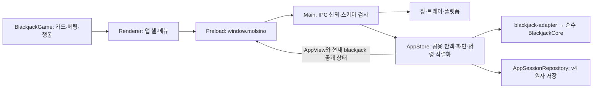

# molsino 메인 기능 기술 설계

**목적:** 게임 화면을 담는 Electron 앱의 창, 입력, 프로세스, IPC 신뢰 경계와 배포 계약을 정의한다.

**요약:** macOS·Windows 공통 오버레이와 플랫폼 정책, Main·Preload·Renderer 경계, 창 상태, 검증 목표를 다룬다. 현재 앱은 메뉴와 공용 작성자를 통해 블랙잭·바카라·빅휠을 연결한다. 앱 상태·저장은 §9, 블랙잭 규칙과 게임별 상태는 [블랙잭 기술 설계](../games/blackjack/technical-design.md)가 담당한다. 사용자 동작은 [메인 기능 제품 설계](product-design.md), 현재 파일과 완료 상태는 [메인 구현 현황](implementation-status.md)을 따른다.

## 목차

- [1. 기술 선택과 책임 경계](#1-기술-선택과-책임-경계)
- [2. 오버레이 경험 참고](#2-오버레이-경험-참고)
- [3. 프로세스와 모듈](#3-프로세스와-모듈)
- [4. 창 구현과 OS별 처리](#4-창-구현과-os별-처리)
- [5. 창 상태와 IPC 신뢰 경계](#5-창-상태와-ipc-신뢰-경계)
- [6. Electron 실행 경계](#6-electron-실행-경계)
- [7. 프로젝트 구조와 패키징](#7-프로젝트-구조와-패키징)
- [8. 검증과 완료 기준](#8-검증과-완료-기준)
- [9. 여러 게임과 공용 잔액의 신규 계약](#9-여러-게임과-공용-잔액의-신규-계약)

## 1. 기술 선택과 책임 경계

macOS와 Windows에서 Electron, TypeScript, React UI, Forge·Vite 빌드를 공유한다. macOS에서 먼저 확인하되 Windows도 빌드·검증 대상으로 둔다. 실제 사용 버전은 `package.json`과 `package-lock.json`이 기준이다.

| 계층 | 현재 선택 | 역할 |
| --- | --- | --- |
| Electron Main | Electron + Node.js | 앱 수명, 단일 인스턴스, 창·트레이, IPC, 현재 게임 저장 연결 |
| Preload | sandbox + contextBridge | Renderer에 제한된 메서드와 구독만 노출 |
| Renderer | React + CSS | 오버레이·메뉴·게임별 화면, 일시적인 입력 초안 |
| 플랫폼 | `src/main/platform/adapter.ts` | macOS·Windows 창 정책의 차이 처리 |
| 계약 검증 | Zod | 창 명령과 게임 명령의 런타임 검증 |
| 패키징·테스트 | Electron Forge + Vite, Vitest, Playwright Electron | OS별 산출물과 자동 검증 |

`src/main/main.ts`는 창·트레이·IPC와 앱 세션 시작을 연결한다. `AppStore`가 공용 잔액·화면·게임 상태를 소유하며 `blackjack-adapter.ts`가 기존 순수 블랙잭 코어를 호출한다. `window.molsino`는 앱 snapshot·명령·구독과 창 API를 노출한다. 저장은 `AppSessionRepository`의 v4 원자 스냅샷으로 통합하고, v1 저장소는 기존 파일 이전 검증에만 사용한다. 바카라 코어와 공개 상태 어댑터도 같은 AppStore에 연결한다.

초기 검증 목표는 macOS 14 이상 arm64와 Windows 11 x64다. 지원 범위는 채택한 Electron 버전과 실제 장비 검증을 함께 확인해 표기한다. 다른 CPU·OS 조합은 별도 검증이 필요하다. Electron은 여러 프로세스를 사용하지만 현재 실행 인스턴스와 공용 앱 세션 상태의 소유자는 각각 하나다.

## 2. 오버레이 경험 참고

### 2.1 공식 문서에서 확인한 펫 동작

ChatGPT 데스크톱의 펫은 macOS와 Windows에서 다른 앱 위에 떠 있고, 드래그 이동·크기 설정·숨기기·위치 복원을 지원한다. OS의 동작 줄이기 설정도 따른다. 이 사용자 경험을 기준으로 삼는다. [OpenAI 공식 Pets 문서](https://learn.chatgpt.com/docs/pets)

### 2.2 설치된 앱에서 읽기 전용으로 확인한 구현 단서

조사 대상은 `/Applications/ChatGPT.app/Contents/Resources/app.asar`이며 번들 식별자는 `com.openai.codex`였다. 패키지 목록과 관련 코드 구간만 읽었고 설치 파일을 변경하지 않았다.

| 관찰 위치 / 심볼 | 확인한 내용 | molsino에 적용할 원리 |
| --- | --- | --- |
| `webview/assets/pet-content-*.js`, `pet-model-*.js` | 펫 화면·모델용 번들 존재 | 창 계층과 화면 상태를 분리 |
| `.vite/build/main-DaMR-wdT.js`, `avatar-overlay` | Electron BrowserWindow 기반 오버레이 제어 코드 | 일반 메인 창과 다른 수명·입력 정책 |
| `showWindow`, `showInactive` | 비활성 상태로 오버레이 표시 | 복원 시 업무 창의 포커스 유지 |
| `setAlwaysOnTop(..., floating)`, `setVisibleOnAllWorkspaces` | 창 레벨과 작업 공간 처리 | 상단 표시와 Spaces 정책을 별도 관리 |
| `setPointerInteraction`, `setKeyboardInteraction` | 마우스와 키보드 상호작용을 각각 관리 | 클릭 수신과 키보드 포커스를 분리 |
| `setIgnoreMouseEvents`와 forwarding 분기 | 클릭 통과 전환 및 이동 이벤트 처리 | 클릭 통과 상태에서도 복구 경로 필요 |
| `isInputShapeSupported`, `setInputShape` | 입력 영역 지원 여부에 따른 분기 | 선택적 클릭 통과는 OS 기능 확인 후 적용 |
| `displayId`, `anchor`, 드래그·화면 변경 처리 | 화면과 기준점 중심의 위치 관리 | 다중 모니터와 위치 복원 모델 |

이 표는 **설치된 특정 빌드의 정적 관찰**이다. 공개 API 계약이나 모든 버전의 구현을 의미하지 않는다. `setInputShape`가 일반 배포 Electron 에서 동일하게 사용 가능하다고 가정하지 않는다. 펫 전체 소스나 내부 로직을 복제하지 않고 공개 OS API로 같은 동작을 구현한다.

### 2.3 이번 구현에 적용하는 결정

펫에서 확인한 비활성 표시, 포인터와 키보드 입력 분리, 위치 기준점 관리 원리를 Electron 공개 API로 구현한다. 설치된 앱의 커스텀 런타임·내부 모듈·펫 이미지에 의존하지 않는다.

- Main이 창·입력 정책을 관리하고 Renderer가 현재 게임의 화면을 그린다.
- 현재 블랙잭 화면과 TypeScript 엔진은 두 OS가 동일한 소스를 사용한다.
- OS별 차이는 PlatformAdapter에 모은다. Swift/C# 엔진이나 별도 UI 포팅은 계획하지 않는다.
- 기본적으로 네이티브 애드온 없이 시작한다. 공개 API만으로 핵심 요구를 충족하지 못하는 경우에만 작은 창 제어 브리지를 검토한다.
- Chromium·Node가 포함되는 만큼 설치 크기와 전체 프로세스 메모리를 측정한다. 작은 창이라는 이유로 작은 메모리 사용을 보장하지 않는다.

## 3. 프로세스와 모듈



| 현재 코드 | 담당 책임 |
| --- | --- |
| `src/main/main.ts` | 앱 수명, 창·트레이, IPC 등록, 앱 세션 로드·복구 |
| `src/main/game/app-store.ts` | 단일 작성자, 공용 잔액, 화면, 중복 명령, 저장 후보·자동 진행 |
| `src/main/game/blackjack-adapter.ts` | 블랙잭 코어에 잔액 주입·결과 추출, 카드 공개 상태 |
| `src/main/persistence/app-session-repository.ts` | v4 스키마·원자 저장·백업·v1/v2/v3 이전 |
| `src/preload/preload.ts` | 제한된 앱·창 API와 구독 |
| `src/renderer/main.tsx` | 오버레이, 메뉴, 공용 잔액, 초기화 확인과 복구 화면 |
| `src/renderer/games/blackjack.tsx` | 블랙잭 카드·베팅 입력·행동·게임 결과 |
| `src/shared/app-contracts.ts` | 앱 envelope·공개 snapshot, 게임 명령 분기 |

모듈을 더 잘게 나눈 `AppCoordinator`, `OverlayWindowController`, `InputPolicyController`, `DisplayPlacementService`, `TrayController`는 초기 설계상의 책임 이름이며 현재 별도 파일로 모두 존재하는 모듈은 아니다. 실제 파일 지도는 [메인 구현 현황](implementation-status.md)을 기준으로 한다. Main은 창과 저장된 게임 상태를 소유하고 Renderer에는 공개 상태만 전한다.

## 4. 창 구현과 OS별 처리

### 4.1 수명과 초기 표시

1. `app.requestSingleInstanceLock()`을 확보한다. 실패하면 종료한다. `second-instance`는 기존 창을 비활성 복원한다.
2. 앱 준비 후 공용 앱 세션을 읽거나 기존 블랙잭 세션을 이전하고 투명 BrowserWindow, 트레이, 창 단축키를 만든다. 모니터 변경 자동 보정은 미구현이며 구 일정은 폐기했다.
3. `show:false` 창에 로컬 `app://molsino/index.html` UI를 로드한다. 현재 코드는 `ready-to-show`에서 `showInactive()`를 호출한다.
4. 현재 초기 표시에는 별도 `ui:ready` 채널이 없다. 초기 로딩 결함이 재현되면 새 로드맵의 버그 분석에서 평가한다.

닫기는 숨김으로 처리하고 명시적 종료에서만 실제 창을 파괴한다. window-all-closed 이벤트로 자동 종료하지 않는다. 종료 플래그를 사용해 close → hide 루프를 막는다. Tray 객체는 Main에서 강하게 참조해 수명을 유지한다.

### 4.2 BrowserWindow 설정

아래는 **설계용 TypeScript 예시**이며 컴파일·실행 검증된 앱 코드는 아니다. preloadPath와 protocol 핸들러는 빌드 결과에 맞춰 초기화한다.

```ts
const overlay = new BrowserWindow({
  width: 280, height: 180,
  frame: false,
  transparent: true,
  backgroundColor: '#00000000',
  hasShadow: false,
  alwaysOnTop: true,
  focusable: false,
  acceptFirstMouse: true,
  skipTaskbar: true,
  resizable: false,
  minimizable: false,
  maximizable: false,
  fullscreenable: false,
  show: false,
  webPreferences: {
    preload: preloadPath,
    contextIsolation: true,
    sandbox: true,
    nodeIntegration: false,
    webSecurity: true,
  },
});
await overlay.loadURL('app://molsino/index.html');
// 현재 구현은 ready-to-show에서 overlay.showInactive()를 호출한다.
```

Windows 투명 창은 frameless로 구성한다. `focusable: false`와 `showInactive()`를 조합한다. 게임별 베팅 입력만 명시적 요청 동안 임시 포커스를 허용한다. 상세 입력 조건은 [블랙잭 기술 설계](../games/blackjack/technical-design.md#5-게임-화면과-입력)를 따른다. [Electron 창 API](https://www.electronjs.org/docs/latest/api/base-window)

루트 HTML·body·React root 배경도 transparent로 둔다. CSS opacity는 정보 레이어에만 적용하고 창 전체 알파는 1로 유지한다. 펼친 창의 우측 상단 색상 전환 버튼에 호버하면 작은 별도 조절창이 나타나며, 그 슬라이더는 전경 불투명도를 20–100%(5% 단위, 기본 65%)로 조절한다. 20%는 완전 비표시를 막는 하한이며 배경 알파를 높이는 설정이 아니다. 조절창은 버튼의 좌우 여유와 현재 display의 workArea를 기준으로 위치를 선택하고 최종 bounds를 화면 안에 보정한다. 버튼↔조절창 사이 이동에는 짧은 닫힘 지연을 둔다. 조절창 전체에는 설정 알파를 한 번 적용하고, 열린 동안에는 양쪽 창에 선택값을 즉시 반영한다. 조절창이 닫힌 게임 창 일반 호버 시 100%·이탈 0.8초 후 선택값으로 돌아간다. 흐림 효과나 그림자로 배경을 채우지 않는다. 화면 확대율은 1로 고정하고 OS DPI를 별도로 처리한다.

### 4.3 플랫폼별 최소 분기

| 항목 | macOS | Windows |
| --- | --- | --- |
| 상단 표시 | setAlwaysOnTop(true, 'floating') | setAlwaysOnTop(true) |
| 작업 공간 | `setVisibleOnAllWorkspaces(true, { visibleOnFullScreen: true })` 호출 중. 실제 Spaces·전체 화면 결과는 OS에서 확인 | 같은 API는 효과 없음. 현재 가상 데스크톱 정책 사용 |
| 복원 | showInactive, 일반 앱 Dock 표시·E2E 전용 숨김 | showInactive, skipTaskbar |
| 트레이 | 단색 Template 이미지, 메뉴 막대 | ICO, 알림 영역 메뉴 |
| 현재 게임 금액 편집 | 명시적 클릭 중에만 메인 창 `setFocusable(true)`·`focus()` | 동일 창 정책 |
| 전체 화면 | Spaces·Stage Manager 확인 | 일반 전체 화면과 독점 전체 화면을 구분 |

공통 상단 표시 기능이 모든 전체 화면·가상 데스크톱에서 같은 결과를 보장하지는 않는다. Windows의 모든 가상 데스크톱에 고정하는 기능은 1차 범위 밖이다. 다른 앱 전체 화면에서 보이지 않을 때도 트레이로 접근 가능해야 한다.

macOS의 프로덕션 Dock 정책은 별도로 유지한다. 프로덕션 패키지를 반복 실행하는 Playwright E2E에만 `MOLSINO_TEST_HIDE_DOCK=1`을 전달하여 `setVisibleOnAllWorkspaces` 이후 `app.dock.hide()`를 한 번 호출하고, `app.dock.isVisible()`로 숨김을 검증한다. 앱 종료 후 OS Dock 항목을 강제로 조작하거나 사용자 Dock 설정을 바꾸지 않는다. 테스트 프로세스의 정상 종료와 Dock 노출은 서로 다른 검증 대상이다. [Electron Dock API](https://www.electronjs.org/docs/latest/api/dock)

### 4.4 포커스와 입력 정책

- 기본 오버레이는 마우스 중심이다. 복원·호버·일반 게임 버튼 클릭에서 `focus()` 또는 `app.focus()`를 호출하지 않는다.
- 창 제어 예외인 전역 Alt+백틱은 Electron Main의 `globalShortcut`으로 앱 준비 후 등록한다. 콜백 `toggleOverlay()`는 보이는 상태면 숨기고, 숨김 상태면 트레이 복원과 같은 `reveal()`(`showInactive`)을 호출한다. 게임 명령·일시정지·키보드 포커스 변경은 없다. 등록 실패는 경고만 남기고 트레이 경로를 유지하며 종료 시 해제한다. 키보드 배열·OS별 실제 조합은 실장비에서 확인한다. [Electron globalShortcut](https://www.electronjs.org/docs/latest/api/global-shortcut), [Accelerator](https://www.electronjs.org/docs/latest/api/accelerator)
- `acceptFirstMouse`는 macOS의 비활성 첫 클릭을 위한 설정이다. 아래 앱으로 클릭을 통과시키는 설정과 구분한다.
- 임시 키보드 포커스는 현재 선택된 블랙잭·바카라·빅휠의 베팅액 편집에 연결돼 있다. Main은 신뢰된 메인 창·베팅 phase·펼침·대화형 상태를 검사하고 `setFocusable(true)`와 `focus()`를 호출한다. 편집 종료·창 blur·숨김·접힘·클릭 통과·reload·phase 변경 때는 `blur()` 뒤 `setFocusable(false)`로 돌아온다. 이전 업무 앱을 강제로 활성화하지 않는다. 금액의 파싱·확정·취소와 게임 명령 조건은 [블랙잭 기술 설계](../games/blackjack/technical-design.md#5-게임-화면과-입력)에 둔다. [Electron BaseWindow 포커스 API](https://www.electronjs.org/docs/latest/api/base-window)
- 키보드·VoiceOver·Narrator용 별도 접근성 창은 현재 제공하지 않는다. 기존 미진행 계획은 폐기했으며 구현 일정은 없다.

비활성 오버레이의 버튼이 첫 클릭에 실행되고 업무 입력 포커스가 유지되는지는 양쪽 OS에서 확인할 조건이다.

### 4.5 클릭 통과

**1차 필수:** 명시적인 전체 창 클릭 통과. `setIgnoreMouseEvents(true)`를 사용하고 해제는 Tray에서 수행한다. 현재 게임의 인라인 편집과 드래그를 먼저 종료한다. `pointer-events:none`이나 투명 CSS만으로 다른 앱에 클릭이 전달되지는 않는다. [Electron 클릭 통과와 드래그](https://www.electronjs.org/docs/latest/tutorial/custom-window-interactions)

자동 부분 클릭 통과는 현재 구현하지 않았다. 구 실험 계획은 폐기했으며 새로운 사용자 요구나 문제를 근거로 별도 선정해야 한다.

### 4.6 이동과 크기 조절

상단 드래그 영역은 `app-region: drag`, 버튼·크기 핸들은 `app-region: no-drag`로 구현한다. 드래그 영역의 클릭 이벤트가 게임 명령으로 이어지지 않게 한다.

**제약:** Electron 공식 문서는 투명 창의 일반 리사이즈를 지원하지 않으며 `resizable:true`가 일부 플랫폼에서 투명도를 깨뜨릴 수 있다고 설명한다. 따라서 true로 바꾸는 것만으로 크기 조절을 구현했다고 보지 않는다. [투명 창 제한](https://www.electronjs.org/docs/latest/tutorial/custom-window-styles)

선택한 구현은 `resizable:false`를 유지하고 **사용자 정의 핸들 → IPC → Main의 setBounds**로 크기를 바꾸는 방식이다.

1. 네 모서리 핸들 pointerdown에서 Main이 시작 프레임, 커서 DIP 좌표, 모서리 방향, UUID resizeToken을 기록한다.
2. Renderer는 pointer capture로 update/end/cancel을 보내고, Main은 strict Zod 스키마와 token을 검증한 뒤 시작점 기준 변화량을 적용한다. Renderer 좌표는 IPC로 받지 않는다.
3. 잡은 모서리의 반대편을 고정하고 220×150 ~ 420×280 DIP 및 시작 display의 workArea로 clamp한다. 이벤트는 최신 값만 합쳐 초당 최대 30회 반영한다.
4. Main의 `screen.getCursorScreenPoint()`를 좌표 기준으로 사용해 물리 픽셀·CSS px 혼용을 피한다. 변한 창에 대한 clientX를 누적하지 않는다.
5. pointerup/cancel, 창 숨김, 클릭 통과, 프리셋 변경, navigation/reload, Renderer 종료 시 토큰을 만료시킨다. 10초 inactivity timeout도 둔다.
6. frame 이벤트에서 다시 IPC를 보내 무한 왕복하지 않는다. 최종 bounds를 Renderer에 전달한다.

기본 크기는 280×180 DIP로 통일한다. 메뉴의 작은/기본/큰 프리셋도 활성 resize token을 먼저 만료하고 workArea 안에서 `setBounds`를 적용한다. 프리셋만으로 임의 크기 조절 요구를 충족했다고 처리하지 않는다.

### 4.7 화면 좌표와 복원

현재 Main은 시작할 때 주 화면 workArea를 읽고 280×180 DIP 창을 배치한다. 리사이즈·프리셋·접힘 경로는 대상 화면의 workArea에 맞춘다. 위치·크기는 메모리에 보관하고 접힘 전 펼친 bounds를 별도로 유지한다. 창 설정을 게임 저장 파일에 넣지 않는다.

디스플레이 추가·제거·배율 변경 이벤트의 자동 위치 보정은 미구현이다. 구 S11의 상세 설계와 보류 일정은 2026-09-18에 폐기했다. 현재 기능의 실제 결함 또는 새 사용자 요구가 있을 때 다시 설계한다.

## 5. 창 상태와 IPC 신뢰 경계

### 5.1 창 상태

Main의 현재 `OverlayViewState`는 `revision`, `visibility`(`expanded | collapsed | hidden`), `opacityPercent`, `opacityPopoverVisible`을 가진다. 창 상태는 게임 상태와 별도의 revision으로 구독한다. 접힘 전 펼친 bounds와 숨기기 전 표시 모드는 Main 메모리에 보관하고, 접힘·숨김·클릭 통과로 활성 resize token과 조절창을 정리한다. 헤더의 드래그·색상 전환·숨기기·종료 조작과 접힘/펼침 창 동작은 메인 기능의 책임이다. 헤더는 현재 화면 이름을 표시하며 잔액·접힌 막대의 진행 여부는 앱 공개 상태에서 가져온다. 헤더의 `▁` 접기 버튼은 제거됐지만 `collapsed` 상태·명령은 유지한다. `−`와 Alt+백틱은 같은 숨김 경로로 연결된다.

숨김·접힘은 표시만 바꾼다. 현재 블랙잭의 딜러 진행과 저장은 Main에서 계속되며 복원 시 최신 공개 상태를 다시 보여 준다. 창 표시 설정은 게임 세션과 별개로 실행 중 메모리에 보관한다. 현재 시작값은 주 화면 오른쪽 아래의 280×180 DIP, 흰색 전경, 불투명도 65%, 펼침, 대화형 입력이다. 전체 창 설정 재실행 초기화에 대한 구 E2E-18 일괄 검증 계획은 폐기했다. 미검증 OS 동작을 보장으로 해석하지 않는다. `preferences.json`은 만들지 않는다.

OS suspend 중에는 실행 자체가 멈출 수 있지만 앱이 별도의 수동 일시정지 상태를 만들지는 않는다.

전경 불투명도는 기본 65%, 20–100%의 5% 단위다. 일반 호버 중 100%로 보여 주고 이탈 0.8초 후 설정값으로 돌아간다. 별도 자식 BrowserWindow인 불투명도 조절창에서 슬라이더를 조작하면 선택값을 즉시 미리 본다. 조절창이 열려 있는 동안에는 일반 호버의 100% 강제를 잠시 해제한다. CSS 전환과 취소 가능한 조절창 닫힘 타이머를 사용하며 `prefers-reduced-motion`에서는 전환을 제거한다. 메뉴·입력창이 열린 동안 정보의 가독성을 유지하는 것이 설계 조건이다. 선택한 불투명도는 실행 중 접힘·펼침과 Renderer reload 뒤에도 유지하고 앱 재실행 시 65%로 시작한다. 조절창은 게임 명령을 받지 않으며, 접힘·숨김·클릭 통과·메인 문서 재로드 때 숨긴다. 포인터·키보드 입력 정책의 추가 변경은 새 게임의 실제 입력 요구에 맞춰 설계한다.

창이나 메뉴는 호버만으로 펼치거나 접지 않는다. 사용자가 조작하려는 버튼의 위치가 포인터 접근 중 바뀌지 않도록 한다.

### 5.2 채널과 Preload 경계

| 현재 채널 | 방향 | 계약 |
| --- | --- | --- |
| `overlay:command` | Renderer → Main | 허용한 창 명령만 처리하며 관련 resize token 만료 |
| `overlay:get-state`, `overlay:state` | 양방향 | Main 소유 창 상태 snapshot/push, 게임과 독립 revision |
| `overlay:set-opacity` | Renderer → Main | 정수 20–100, 5% 단위 검증 |
| `overlay:opacity-popover` | Renderer → Main | 허용된 창·URL에서 anchor와 호버 수명 검증 |
| `overlay:resize` | Renderer → Main | start/update/end/cancel, UUID token과 좌표·크기 제한 |
| `overlay:amount-edit-focus` | Renderer → Main | 현재 게임의 베팅액 편집에 사용하며 창·게임 상태 모두 검사 |

Preload는 `window.molsino`에 앱 명령·snapshot·구독과 `OverlayAPI`를 노출한다. `window.blackjack`은 노출하지 않는다. `contextBridge`는 기능별 메서드만 제공하고 raw `ipcRenderer`나 임의 channel invoke를 노출하지 않는다. 구독은 Electron event 객체를 제거한 payload를 전달하고 해제 함수를 반환한다. Renderer는 창 상태 구독을 먼저 설치한 뒤 snapshot을 요청하며, 늦게 도착한 낮은 revision의 snapshot이나 push를 버린다. 이 창 revision은 게임 revision과 독립적이다. Preload는 sandbox 호환 단일 번들이다. 구 초안의 `overlay:mode`, `utility:open`, `ui:ready`는 현재 채널이 아니며 신규 구현 목록에서 제외했다. [Electron Context Isolation](https://www.electronjs.org/docs/latest/tutorial/context-isolation)

Main은 sender `webContents`, `senderFrame`, 최상위 프레임과 허용된 앱 URL을 함께 검사한다. TypeScript 타입만 믿지 않고 Zod로 입력을 검증하며 알 수 없는 필드와 명령을 거부한다. 조절창은 정확한 팝업 URL에 대해 허용한 창 상태 API만 호출한다. 신뢰되지 않는 문서에는 상태 push도 보내지 않는다. 게임 명령·공개 상태·홀 카드 은닉 계약은 [블랙잭 기술 설계](../games/blackjack/technical-design.md#2-게임-명령과-공개-상태)를 따른다.

### 5.3 Renderer 장애

현재 `render-process-gone`은 오버레이를 숨기고 오류를 기록한다. `unresponsive` 감지와 새 창 생성은 구현되지 않았다. 트레이 복원은 기존 창의 `showInactive()` 경로이며 새 Renderer를 만드는 복구를 보장하지 않는다.

장애 후 복원 실패는 [N01 점검](../session-reports/N01-bug-review.md)에서 재현했다. 버그 수정 세션은 계획에서 삭제했으며 바카라 착수 조건으로 삼지 않는다. 구 S16의 자동 창 재생성 설계를 무조건 구현하는 일정은 폐기했다. 정상 reload에서 게임 상태를 재구독하는 기존 동작은 유지한다.

## 6. Electron 실행 경계

런타임은 패키지 안의 UI만 로드한다. Main의 Node 권한과 Renderer를 분리하기 위해 다음을 구현 계약으로 둔다. [Electron 보안 가이드](https://www.electronjs.org/docs/latest/tutorial/security)

- contextIsolation:true, sandbox:true, nodeIntegration:false, webSecurity:true를 명시한다.
- `app://molsino`를 standard/secure 사용자 프로토콜로 등록하고 정해진 번들 파일만 매핑한다. 정규화 후 번들 루트 밖 경로와 symlink 탈출을 거부한다.
- CSP는 기본 self, 외부 connect 차단, object/base/frame 제한으로 구성한다. 개발 서버 HMR 허용은 개발 빌드에만 둔다.
- 임의 navigation과 window.open은 차단한다. 모든 새 창은 Main의 정해진 경로로 생성한다.
- Preload는 파일 읽기·셸 실행·raw IPC를 노출하지 않는다. 입력값은 텍스트로 렌더링한다.
- 외부 콘텐츠·계정·카메라·마이크·화면 녹화 권한은 필요하지 않으며 사용하지 않는다.
- 공용 게임 세션 저장은 로그와 분리한다. 전체 슈·비공개 카드·로컬 사용자 경로를 정상 로그에 남기지 않는다. 저장 필드는 [블랙잭 기술 설계](../games/blackjack/technical-design.md#4-명령-직렬화와-세션-저장)를 따른다.

## 7. 프로젝트 구조와 패키징

현재 코드의 주요 위치는 §3의 표와 [메인 구현 현황](implementation-status.md)에 둔다. 설계 초안에 있던 `app-coordinator.ts`, `overlay-window-controller.ts`, 별도 OS별 엔진·UI 파일은 현재 파일로 간주하지 않는다. OS 차이는 가능한 한 플랫폼 경계에 모으고 Renderer에서 게임 코어의 비공개 런타임 상태를 직접 읽지 않는다.

Electron Forge + Vite로 Main·Preload·Renderer를 각각 빌드한다. macOS는 Universal 앱 ZIP, Windows는 설치 EXE와 포터블 ZIP을 만든다. 명령과 현재 산출물은 [빌드와 배포](building-distribution.md), 정확한 스크립트·버전은 `package.json`과 `package-lock.json`을 기준으로 한다. 초기 자동 업데이트와 서버 배포는 범위 밖이다. 서명 자격 증명은 CI 비밀 저장소나 로컬 키체인에 두고 소스에 넣지 않는다. Windows 빌드 성공만으로 투명 창 입력 동작을 통과 판정하지 않는다. [Electron Forge](https://www.electronforge.io/)

## 8. 검증과 완료 기준

### 8.1 오버레이 검증 범위

투명 합성·비활성 첫 클릭·트레이 복구·사용자 정의 크기 조절·접힘·OS 작업 공간·단축키는 실제 앱과 해당 OS에서 확인한다. 고정 크기 프리셋만으로 사용자 정의 크기 조절을 통과 처리하지 않는다. 투명도 최종 판정은 DevTools를 닫은 패키지에서 한다. 현재 적용 시나리오와 폐기된 구 계획의 식별자는 [메인 기능 E2E 테스트 설계](e2e-test-plan.md)가 기준이다.

### 8.2 공통 IPC·창 검증

- 등록되지 않은 sender·하위 frame·낯선 URL에서 온 창/게임 IPC를 거부하고 신뢰되지 않는 문서에 창 상태나 게임 상태를 push하지 않는다. 조절창은 허용된 창 API만 사용하며 게임 명령을 호출하지 못한다.
- 알 수 없는 창 명령, 잘못된 불투명도·anchor·resize token, 유한하지 않은 좌표와 창 크기를 거부한다. resize token의 시작·종료·취소·숨김·reload 수명과 220×150~420×280 DIP 경계를 검증한다.
- 창 상태의 구독 설치·해제, snapshot과 push의 역순 도착, Renderer reload 뒤 최신 창 revision 적용을 검증한다. 게임 상태의 revision·명령 중복과 비공개 정보는 [블랙잭 기술 설계](../games/blackjack/technical-design.md#6-검증과-완료-기준)가 담당한다.
- Playwright Electron은 UI 자동화의 보조 수단이다. 다른 앱 포커스·실제 클릭 통과·투명 합성은 DOM 검사만으로 통과 처리하지 않고 macOS·Windows GUI에서 확인한다.

### 8.3 성능과 OS 확인의 범위

현재 측정·미확인 범위는 [구현 현황](implementation-status.md)과 당시 보고서를 따른다. 구 계획의 고정 CPU·메모리·응답 시간 목표 및 일괄 측정 세션은 폐기했다. 실제 지연·자원 문제가 확인되면 장비·OS·Electron 버전·재현 장면을 기준으로 새 개선을 선정한다.

### 8.4 완료 범위

현재 동작과 검증 사실은 영역별 구현 현황에 기록한다. 구 P0~P3의 잔여 완료 게이트는 폐기했으며 앞으로의 완료 조건은 [새 세션 로드맵](../work-session-roadmap.md)을 따른다. 기존 보안·잔액 보존·플레이 규칙을 완화하는 의미는 아니다.

## 9. 여러 게임과 공용 잔액의 신규 계약

**상태:** N02에서 공용 기반과 블랙잭 연결을 구현했다. N03에서 바카라, N05에서 빅휠 상태·자동 진행·검증과 화면을 연결했다. 사용자 동작은 [메인 제품 설계](product-design.md#5-메인-메뉴와-공용-잔액의-신규-설계)가 기준이다.

### 9.1 소유권과 상태

Main의 앱 단위 작성자가 공용 잔액, 게임별 상태, 화면 선택, 진행 중 판을 소유한다. 기존 블랙잭 GameStore 두 개를 만들어 각각 잔액을 저장하지 않는다. 게임 코어는 서로의 규칙·슈·결과를 변경하지 않는다.

새 저장 스냅샷의 개념 구조는 다음과 같다. 정확한 TypeScript·Zod 정의는 `src/shared/app-contracts.ts`, `src/shared/table-levels.ts`와 저장 모듈이 기준이다.

```ts
type GameId = 'blackjack' | 'baccarat' | 'bigwheel';
interface AppSessionV4 {
  schemaVersion: 4;
  table: { selectedLevel: 1 | 2 | 3 | 4 | 5 | 6; bestBankrollCents: number };
  sessionId: string;                 // 전체 새 시작마다 새 UUID
  revision: number;                  // 앱 전체의 확정 상태 순서
  screen: 'menu' | GameId;
  wallet: { balanceCents: number };  // 잔액의 유일한 저장 위치
  activeRoundGameId: GameId | null;
  games: {
    blackjack: BlackjackStateWithoutBalance | null;
    baccarat: BaccaratStateWithoutBalance | null;
    bigwheel: BigWheelStateWithoutBalance | null;
  };
  lastAppliedCommand: {
    sessionId: string; commandId: string; revision: number;
  } | null;
}
```

- `activeRoundGameId`는 미완료 판이 있는 게임과 일치한다. 다른 게임은 베팅 전 또는 정산된 결과 상태여야 한다. 동시에 두 판이 진행되거나 잠금과 phase가 다르면 손상 상태로 판정한다.
- 베팅은 딜 또는 회전 시작 시 잔액에서 차감하며 차감·배분 상태·게임 잠금을 함께 저장한다. 블랙잭 보험·더블·스플릿 추가금도 같은 공용 작성자에서 처리한다.
- 정산 완료는 지급·결과·원장·게임 잠금 해제를 같은 스냅샷에 저장한다. 저장 전에는 메뉴 이동을 허용하지 않는다.
- 게임별 슈·베팅 설정·결과·원장은 게임 상태에 둔다. 잔액을 게임 상태에 중복 저장하지 않는다.
- 현재 BlackjackCore는 `SessionState.balanceCents`를 입력으로 요구한다. 어댑터가 공용 잔액을 일시적으로 주입해 기존 전이를 실행하고 결과 잔액과 잔액을 뺀 게임 상태를 하나의 후보로 추출한다. 이 임시 객체는 별도 작성자·저장 상태가 아니다.
- 메뉴 복귀와 게임 진입은 정산·슈를 다시 만들지 않는다. 이전 게임의 베팅액이 현재 잔액보다 커졌으면 새 베팅 상태에서 현재 잔액에 맞춰 조정한다. 과거 판의 wager·원장을 수정해 검증을 통과시키지 않는다.

### 9.2 명령과 공개 상태

Preload API는 `window.molsino`의 앱 명령·snapshot·상태 구독과 창 API다. 앱 행동은 `selectLevel {level}`, `selectGame {gameId}`, `goToMenu`, `resetAll`, `retrySave`와 `blackjack {action}`·`baccarat {action}`·`bigwheel {action}`의 strict 분기다. `blackjack` 분기 안에는 게임 행동만 허용하고 게임별 `resetSession`·`retrySave`는 거부한다. Renderer에 임의 게임 모듈 이름·파일 경로·내부 진행 명령을 노출하지 않는다. Renderer·E2E는 `window.molsino`를 사용한다. 과거 GameStore의 보조 테스트는 남지만 런타임에는 AppStore만 연결한다.

모든 변경 명령은 `sessionId`, `commandId`, `expectedRevision`을 검증한다. 게임 명령은 현재 화면과 `gameId`, 허용 행동을 함께 검사한다. 등록되지 않은 게임 선택은 거부한다. 메뉴·딜·초기화·자동 진행은 같은 busy/직렬 경로를 통과하며, 늦게 도착한 이전 게임의 명령은 현재 게임에 적용하지 않는다.

중복 명령은 재실행하지 않는다. 새 시작 이전 sessionId의 명령은 거부한다. 다만 직전 확정된 resetAll의 동일 commandId·요청 sessionId 재전송은 저장된 처리 기록으로 먼저 식별해 이미 완료됐음을 반환하고 다시 초기화하지 않는다. 동일 명령의 캐시 응답과 최신 snapshot을 구분하며 낮은 revision 응답이 화면을 되돌리지 않게 한다. 정상 종료 대기는 앱 작성자 전체의 저장을 대상으로 한다.

공개 `AppView`는 공용 잔액·화면·진행 판·이동 가능 여부·저장/복구 상태와 게임별 `blackjack`·`baccarat`·`bigwheel` 공개 상태를 제공한다. 현재 화면 외의 게임 상태는 null이며 미공개 카드·슈를 포함하지 않는다. 창 revision은 계속 게임과 독립이다. 저장 실패처럼 확정 revision을 올리지 않는 상태도 전달할 수 있도록 공개 이벤트에는 별도 단조 증가 `viewSequence`를 둔다. Renderer는 구독을 먼저 설치하고 초기 snapshot을 요청하며 늦은 이벤트를 버린다. `viewSequence`는 구독 연결 수명 안에서 비교하고 새 연결에서는 기준을 초기화한다. 성공한 공용 저장만 durable revision을 증가시킨다.

기존 IPC 최상위 문서·sender·URL 검사, strict 스키마, 조절창 권한 제한은 새 API에도 적용한다. 미공개 카드·남은 슈·내부 원장은 공개하지 않는다.

### 9.3 게임 이동과 앱 시작

- Main은 베팅 전 또는 저장된 결과에서만 `goToMenu`·`selectGame`을 허용한다. 진행 중 판·busy·pending save·복구 필요 상태는 거부한다.
- 이동하기 전에 인라인 편집·불투명도 팝업·resize token을 정리한다. 저장된 베팅은 유지하고 미확정 초안만 취소한다.
- 화면 이동도 공용 revision의 변경으로 직렬화한다. UI의 disabled 상태만으로 경합을 방지하지 않는다.
- 저장된 `screen`은 Renderer reload의 복원에 사용한다. 앱 프로세스 재시작 시 미완료 판이 있으면 해당 게임, 없으면 메뉴로 정규화한다. 화면이 달라지면 내부 명령으로 저장·revision을 갱신한 뒤 표시한다. 게임 카드·금액은 바꾸지 않는다.
- 자동 진행 예약은 저장된 active game과 phase에만 연결한다. 숨김·접힘은 예약을 취소하거나 판을 초기화하지 않는다.

### 9.4 저장과 구 형식 이전

새 파일은 같은 userData 아래 `app-session.json`과 `app-session.backup.json`을 사용한다. 게임들과 지갑을 분리된 파일로 동시에 갱신하지 않는다. 기존 원자 쓰기·검증된 백업·실패 후보 재시도 원리를 재사용하되 스키마는 별도로 정의한다.

1. 새 primary가 있으면 새 형식만 읽는다. 손상·미래 버전이면 새 백업 복구 화면으로 보내고 과거 블랙잭 파일로 자동 후퇴하지 않는다.
2. 새 primary가 없고 새 backup이 있으면 신규 초기화나 구 형식 재이관 대신 새 백업 복구를 안내한다.
3. 새 파일 쌍이 모두 없으면 기존 `session.json`·`session.backup.json`을 기존 검증기로 확인한다. 손상·미래 버전이면 원본을 유지하고 명시적인 복구 선택을 받는다.
4. 유효한 기존 세션은 공용 잔액으로 **그 금액 그대로** 옮긴다. 블랙잭 슈·카드·phase·베팅·원장·revision·직전 처리 명령을 보존하고 바카라와 빅휠은 null로 둔다. 기존 플레이 중 금액은 이미 차감됐으므로 다시 차감하지 않는다.
5. 새 sessionId를 만들고 직전 명령을 새 envelope의 중복 처리 계약에 맞춰 연결한다. 이관 성공 후 새 primary를 다시 읽어 검증하고 기존 파일은 변경·삭제하지 않는다. 구 파일이 유효하면 반복 변환의 입력도 동일하므로 미완료 이관의 임시 파일은 승격하지 않고 다시 이관한다.
6. 새 primary 생성이 끝났다면 이후 실행은 1번을 따르므로 초기 금액이나 정산을 다시 적용하지 않는다. 보존한 구 파일은 수동 호환성 자료이며 자동 동기화하지 않는다. 구 앱과 신 앱을 번갈아 실행해 생기는 두 형식의 진행을 자동 합치지 않는다.
7. 어떤 형식의 저장도 없을 때만 신규 공용 $100 세션을 만든다. 복구 중 새 시작은 사용자의 명시적 선택과 원본 보존 후에 수행한다.

새 primary·backup은 앱 스키마와 게임별 규칙·카드·원장·잠금 일관성을 모두 검사한다. 한 게임 데이터가 손상됐다고 공용 잔액을 추정 복구하지 않는다. 파일 sync·원자 교체의 OS 한계는 기존 저장 정책과 같다.

### 9.5 실패·초기화

저장 실패 시 마지막 확정 상태와 계산된 후보를 구분한다. 같은 후보를 재시도하고 카드를 다시 뽑거나 잔액을 다시 차감하지 않는다. 메뉴 이동·다른 게임·초기화를 막고 오류와 저장 재시도 경로를 제공한다. 명시적 종료를 선택하면 미확정 후보가 사라질 수 있음을 표시하며 재기동은 마지막 확정 상태로 복원한다.

`resetAll`은 미완료 판이 없는 메뉴에서만 가능하다. 사용자 확인 뒤 새 sessionId, $100, 기본 베팅 설정, 빈 결과·원장·바카라 기록과 미생성 게임 상태를 한 번에 저장한다. revision은 기존 값에서 증가시키고 sessionId가 바뀌면 이전 명령을 거부한다. 새 시작 명령 자체의 응답 유실은 저장된 직전 처리 명령으로 성공을 식별해 같은 초기화를 반복하지 않는다. 실패하면 기존 세션·금액·기록을 유지한다.

### 9.6 구현 경계

새 앱 작성자·저장 검증·게임 어댑터의 파일 배치는 §3과 구현 현황을 따른다. 블랙잭 전체 소스 이동이나 범용 게임 플러그인 프레임워크를 선행 조건으로 삼지 않는다. 바카라 코어는 블랙잭 `SHOE_SIZE=312`·규칙 상수를 그대로 재사용하지 않는다. 게임별 신규 계약은 [바카라 기술 설계](../games/baccarat/technical-design.md), 검증은 [메인 E2E 설계](e2e-test-plan.md)를 따른다.

### 9.7 N02 단계 검토와 구현 배치

2026-09-18 사용자 범위 조정으로 메뉴·앱 기반과 블랙잭 분리를 N02, 바카라를 N03으로 분리했다.

| 단계 | 구현 배치 | 확인할 실패 조건 |
| --- | --- | --- |
| 공용 상태·이전 | AppStore와 AppSessionRepository, blackjack-adapter | 구 파일 불변·센트/보험/스플릿 판 보존·새 파일 우선·중복 지급 방지 |
| 메뉴·앱 API | sessionId/commandId/expectedRevision, 별도 viewSequence | 딜/이동 경합·이전 세션·준비 중 게임·판 진행/저장 중 이동 거부 |
| 화면 분리 | 앱 셸과 BlackjackGame, 메뉴의 초기화 확인 | 입력 초안 취소·최소 크기·재실행 화면·블랙잭 회귀 |

파일 접근이나 최초 저장·이관·시작 화면 정규화가 실패하면 원본을 유지하고 불러오기 재시도만 제공한다. 손상·미래 버전의 명시적 복구와 I/O 재시도를 구분한다. 내부 전이 오류는 후보가 없는 저장 오류로 표시하지 않는다. 미확정 후보가 남은 상태의 종료는 손실 범위를 확인한 뒤 진행한다.

### 9.8 공통 레벨·v3 이전·표시 타임라인

`src/shared/table-levels.ts`가 여섯 레벨의 수치·타입·정규화·검증을 제공한다. AppStore는 메뉴·진행 잠금·현재 잔액으로 `selectLevel`을 검증하고 `setBet`와 `deal`의 기본 베팅 한도를 검사한다. `AppView.table`에 확정 선택·입장액·공통 한도·최고 잔액·최고 레벨을 제공한다. 정산으로 새 결과가 만들어질 때만 최고 잔액을 갱신한다. 게임 코어의 추가 베팅 규칙은 변경하지 않는다. 최소액을 낼 수 없으면 pending bet은 최소액 placeholder를 유지하되 딜을 거부한다.

v3는 `table.selectedLevel`과 `table.bestBankrollCents`를 저장한다. 유효한 v2는 Lv.1·현재 지갑 잔액을 최고 기록의 시작값으로 추가하며 기존 sessionId·revision·카드·슈·판·원장·베팅·직전 명령을 보존한다. 진행 판의 큰 베팅에 새 상한을 소급 적용하지 않고 다음 베팅부터 정규화한다. 현재 형식으로 이전을 노출하기 전에 v4 저장과 재검증을 마치며 backup에는 검증된 동등 v4 상태를 남긴다. v2 backup도 검증/변환 후 명시적 복구 대상으로 제공한다. 미래 버전·손상·I/O 실패는 기존 복구 정책을 따른다. v1 원본 파일은 변경하지 않는다.

게임 공개 상태의 `roundId`, 카드 ID, `cardRevealOrder`는 이미 공개 가능한 카드만 담는다. Renderer의 `presentation.ts`와 `use-presentation.ts`는 이 공개 정보로 독립 타임라인을 구성하며 엔진을 진행시키거나 정산 명령을 보내지 않는다. 빠른 연속 snapshot도 대기 카드 순서를 유지하고 동일 카드·스플릿 이동·상태 재송신은 재연출하지 않는다. 450/140/300ms 초기 시간과 결과 노출 규칙은 [제품 설계 §6](product-design.md#6-공통-테이블-레벨과-카드-공개)을 따른다. 저장 오류는 확정 공개 상태 위에 즉시 표시하고 숨김·reload·화면 변경 시 최신 공개 상태로 맞춘다. 실제 OS 합성·외부 앱 포커스 검증 범위는 세션 보고서와 구분한다.


### 9.9 빅휠과 v4 이전

N05의 v4는 기존 v3 상태에 `games.bigwheel`을 추가한다. 이전 v2/v3 strict 스키마를 별도로 검증한 뒤 v2에는 공통 table을, 두 형식에는 `bigwheel: null`을 추가한다. v3의 선택 레벨·최고 잔액·sessionId·revision·진행 판·차감·최근 명령을 바꾸지 않는다. 구 형식 primary/backup도 기존 원자 저장·명시적 백업 복구 정책을 따른다. v4 손상을 구 버전으로 해석해 복구하지 않는다.

빅휠 회전 시작은 Main의 난수로 확정한 칸과 총 베팅 차감·잠금을 함께 저장한다. 자동 정산은 같은 칸을 사용하며 Renderer에 spinning의 미공개 결과를 보내지 않는다. 결과 확정과 표시 연출은 독립이고 재시도는 같은 후보를 저장한다. 상세 코어·공개 상태 계약은 [빅휠 기술 설계](../games/bigwheel/technical-design.md)가 담당한다.
